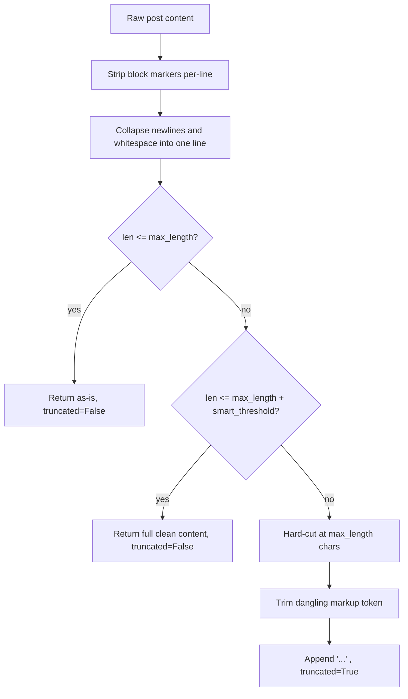
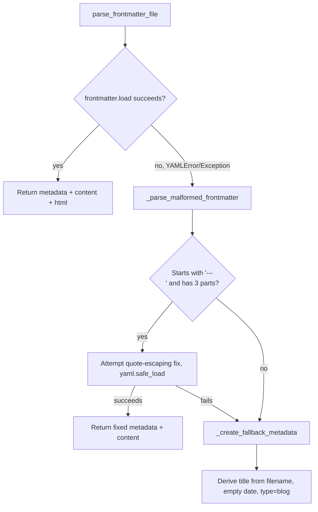

# `utils.py` — Content Processing Foundation

## What this module is for

Salasblog2 stores every post as a Markdown file with YAML frontmatter and
serves a pre-generated static site built from those files. Almost every
other module — the site generator, the admin panel, the Raindrop importer,
the `blogger_api.py` XML-RPC adapter — needs to do the same handful of
things to that content: parse frontmatter, turn Markdown into HTML, produce
a short excerpt for a listing page, sort posts by date, build a safe
filename. `utils.py` is where all of that lives.

The module is deliberately **pure**: no imports from anywhere else in this
codebase, no knowledge of FastAPI, no filesystem layout assumptions beyond
"give me a `Path`." That isolation is what makes it the *foundational*
module — everything else can depend on it without creating a cycle, and
every function here can be understood (and tested) without spinning up the
rest of the application.

## Two families of functions

Reading straight down the file, the functions fall into two groups that
don't obviously announce themselves as groups:

- **Text/Markdown processing** — dates, excerpts, first-paragraph
  extraction, the Markdown-to-HTML pipeline, frontmatter parsing and its
  fallback repair logic.
- **Naming and data-shaping** — URL generation, filename sanitization,
  tag/collection slugs, sorting and grouping posts, and turning a Raindrop
  bookmark's JSON into a fully formed Markdown post.

The rest of this document follows that grouping, starting with the part
that has the most interesting failure modes: excerpts.

## Excerpts: squashing block markup into one line, safely

A blog listing page shows a short teaser under each post title. The naive
approach — take the first *N* characters of the raw Markdown and slap on
an ellipsis — breaks in two specific ways that this module had to learn
the hard way.

### Problem 1: block markers only mean something at line-start

Markdown's block constructs — `## Heading`, `> blockquote`, `- bullet`,
`1. numbered item` — are only recognized by a Markdown parser when the
marker sits at the *start of a line*. An excerpt's whole point is to
collapse a multi-line post into one flowing line of text for a listing
page. Do that collapsing *before* stripping block markers, and a
perfectly normal `## Heading` ends up buried mid-sentence, where the
Markdown renderer no longer treats `##` as a heading marker — it just
prints two literal hash characters in the middle of the excerpt.

The fix is a small preprocessing pass that strips block markers from each
line *while lines still exist* — before anything gets joined:

```python
_BLOCK_MARKDOWN_MARKER_RE = re.compile(r"^\s{0,3}(?:#{1,6}\s+|>+\s?|[-*+]\s+|\d+\.\s+)")

def _strip_block_markdown_markers(content: str) -> str:
    return "\n".join(
        _BLOCK_MARKDOWN_MARKER_RE.sub("", line) for line in content.split("\n")
    )
```

The regex mirrors CommonMark's own tolerance for up to three leading
spaces before a block marker still counts as "start of line" (four or
more would make it an indented code block instead). This is a useful
general lesson: **any text transform that changes line structure must run
after, not before, any earlier step that depends on line structure.**
Order of operations here isn't cosmetic — swapping these two lines
reintroduces the bug.

### Problem 2: character-count truncation cuts mid-token

Once the content is a single line, truncating at a fixed character count
is the obvious next step — but Markdown "tokens" like `**bold**`,
`[link](url)`, and raw `<tag>` HTML have no idea they might get cut in
half. A cut that lands after `**foo` but before the closing `**` leaves an
*unmatched* marker. Markdown doesn't silently ignore an unmatched `**` —
it prints the two literal asterisks as text, which is exactly the kind of
visual glitch that shows up in a listing page and looks like a rendering
bug rather than a content bug.

`_trim_dangling_markup()` runs after the character cut and removes
whichever half-open token got left behind:

```python
def _trim_dangling_markup(text: str) -> str:
    text = re.sub(r"<[^>]*$", "", text)  # unclosed HTML tag
    text = re.sub(r"!?\[[^\]]*(\]\([^)]*)?$", "", text)  # unclosed markdown link/image
    if text.count("**") % 2 == 1:
        text = text[: text.rfind("**")]
    return text
```

Each check is anchored to the *end* of the string (`$`), because the only
thing that can be dangling is whatever the truncation just cut through —
anything earlier in the string was already well-formed. Note the ordering
dependency between the three checks: an unclosed `[link text` gets
stripped by the link/image pattern before the `**` count is even
evaluated, so a `**[bold link**` truncated mid-link doesn't confuse the
bold-counter with a phantom odd count contributed by a link fragment that
is about to be removed anyway.

This is not a full Markdown parser — it's a small set of targeted patches
for the token types that are common in this blog's actual posts (bold,
links, images, inline HTML). It doesn't handle italics (`*`/`_`), inline
code spans (`` ` ``), or nested emphasis, which is a reasonable scope
limit given the input, but worth knowing as a boundary rather than
discovering it as a surprise later.

### The full decision flow



The `smart_threshold` step is a small but pleasant design choice: if the
content is only a *little* over the length limit — close enough that
truncating would save almost nothing — the function returns the full
text untruncated rather than lopping off a handful of characters for a
marginal gain. `create_excerpt_with_info()` returns the truncation flag
alongside the text (`tuple[str, bool]`) precisely so a caller can decide
whether to show a "read more" link; `create_excerpt()` is the older,
text-only convenience wrapper kept around for callers that don't need the
flag.

Both length knobs (`EXCERPT_LENGTH`, `EXCERPT_SMART_THRESHOLD`) read from
environment variables with hardcoded defaults (150, 100) rather than being
passed down from a config object — consistent with this module's "no
project dependencies" constraint, at the cost of the defaults being
invisible unless you already know to look at `os.getenv`.

## `extract_first_paragraph`: a second, HTML-based excerpt strategy

Distinct from `create_excerpt_with_info`, `extract_first_paragraph()`
takes a different approach entirely: instead of truncating raw Markdown by
character count, it **renders the Markdown to HTML first**, then extracts
whatever landed inside the first `<p>` tag:

```python
html_content = process_markdown_to_html(content)
p_match = re.search(r"<p[^>]*>(.*?)</p>", html_content, re.DOTALL)
```

This sidesteps the dangling-token problem entirely — the Markdown parser
has already resolved every `**bold**` and `[link](url)` into well-formed
HTML, so stripping HTML tags afterward can't leave an orphaned marker. The
tradeoff is that it captures a whole semantic unit (the first paragraph),
not a fixed-length excerpt, so it's a different tool for a different job:
good for "what's the first thing this post says," not for "give me
exactly ~150 characters for a grid layout." The regex-based tag search
(rather than a real HTML parser) is a pragmatic shortcut that works
because `process_markdown_to_html`'s output is well-formed HTML the module
itself just generated — not arbitrary third-party HTML.

There's a fallback path for content with no `<p>` tag at all (e.g., a post
that's just a single line of text with no block wrapping), which does its
own from-scratch truncation — including a sentence-boundary heuristic
(split on `". "` and check if the first sentence is under 200 chars). This
duplicates some of the truncation concerns from the excerpt functions
above but doesn't share the dangling-markup fix, since by this point the
text has already been through the HTML round-trip and stripped of tags —
a different class of hazard than raw Markdown truncation.

## The Markdown-to-HTML pipeline

`process_markdown_to_html()` is the single choke point every rendering
path uses. Two things about it are worth calling out.

**A module-level singleton processor.** `python-markdown`'s `Markdown`
object is expensive enough to construct (it wires up its extensions) that
the module caches one instance rather than building a fresh one per call:

```python
_md_processor = None

def get_markdown_processor():
    global _md_processor
    if _md_processor is None:
        _md_processor = markdown.Markdown(
            extensions=["meta", "toc", "codehilite", "tables", "fenced_code", "nl2br"]
        )
    return _md_processor
```

But `Markdown` objects are *stateful* — internally they accumulate parse
state (like the table of headers used for `toc`) across a single
`convert()` call, and that state needs to be cleared before reuse.
`process_markdown_to_html()` calls `processor.reset()` immediately before
every `convert()`, which is what makes the singleton safe to share across
unrelated posts. Skipping the reset is a classic shared-mutable-state bug:
it would work fine in isolation and then intermittently leak stale TOC or
footnote state from one post's conversion into the next one rendered in
the same process.

**Preprocessing malformed links before parsing.** Before conversion, the
function does light cleanup of link syntax with spaces inside the
brackets — `[ text ]( url )` → `[text](url)`:

```python
fixed_content = content.replace("[ ", "[")
fixed_content = fixed_content.replace(" ](", "](")
fixed_content = fixed_content.replace("]( ", "](")
fixed_content = fixed_content.replace(" )", ")")
```

This is a blunt, order-sensitive sequence of `str.replace()` calls rather
than a single regex — readable, but it's a naive character-position fix
rather than a syntax-aware one, and it will touch any occurrence of those
substrings, not just ones inside actual link syntax (see the closing
observations).

The `extensions` list is itself a small design statement: `meta` lets
frontmatter-adjacent metadata blocks be recognized, `toc` and `codehilite`
support long-form technical posts with headers and code samples, `tables`
and `fenced_code` cover GitHub-flavored Markdown authors expect, and
`nl2br` treats a single newline as a line break — a blogging-friendly
default, since most blog authors don't know (or want to remember) that
CommonMark requires a blank line to start a new paragraph.

## Frontmatter parsing and its layered fallback

`parse_frontmatter_file()` is the entry point for reading a post off disk.
The common path is a thin wrapper around the `python-frontmatter` library,
returning a dict with both the raw Markdown and its rendered HTML
pre-computed:

```python
return {
    "metadata": post.metadata,
    "content": post.content,
    "raw_content": post.content,
    "html_content": process_markdown_to_html(post.content),
}
```

What makes this function worth a closer look is what happens when parsing
*fails*. Blog content accumulated over time, by hand, sometimes has
malformed YAML frontmatter — an unescaped quote inside a title, most
commonly. Rather than let one bad file take down a whole site build, the
module tries progressively less ambitious recovery strategies:



The escaping fix targets one specific, apparently-observed failure mode —
an unescaped `\"` inside a YAML value — by doubling the backslash before
retrying `yaml.safe_load`. It's a narrow patch, not a general YAML
repair tool, and the comments say as much. When even that fails, the
**ultimate fallback** guarantees the function never raises: it derives a
readable title from the filename (`my-post-title.md` → `"My Post Title"`)
and treats the entire file body as content with empty metadata. This
"always return something renderable" contract matters a lot for a static
site generator — one malformed file degrading gracefully to a
poorly-titled post beats an exception that aborts the whole site build.

Note the very broad exception handling — `except (yaml.YAMLError,
Exception)` — which is functionally identical to `except Exception`,
since `Exception` already covers `YAMLError`. It reads as intent
("we specifically expect YAML errors here, but catch anything") more than
as a meaningful distinction, worth simplifying (see observations).

## Dates: parse once, use everywhere

Every date-handling function in this module — display formatting, sort
ordering, month-grouping — routes through one private parser,
`_parse_iso_date()`, which accepts either a full ISO datetime
(`2024-03-01T10:30:00Z`) or a bare date (`2024-03-01`) and normalizes both
to a naive `datetime` (timezone info is deliberately stripped with
`.replace(tzinfo=None)`, since this blog doesn't do timezone-aware
comparisons anywhere downstream).

The interesting design decision is what happens when a date **fails** to
parse. `format_date()` degrades gracefully — it just prints the original
string back. `parse_date_for_sorting()`, used when ordering posts on a
listing page, can't return "the original string" (sorting needs a
`datetime`), so it logs a warning and returns `datetime.min`:

```python
def parse_date_for_sorting(date_str: Optional[str]) -> datetime:
    date_obj = _parse_iso_date(date_str)
    if date_obj is None:
        _logger.warning(
            f"Unparseable date '{date_str}' — post will sort to bottom of listings"
        )
        return datetime.min
    return date_obj
```

`datetime.min` sorts a post to the *very bottom* of a reverse-chronological
listing (newest-first) rather than crashing the sort or silently dropping
the post from the list — a deliberately visible failure mode (a post that
never seems to update its position) rather than a silent one. The log
message spells out the consequence, which is a nice habit: a future reader
grepping logs for "why is this post buried" gets the answer directly
instead of having to reverse-engineer the sort key.

## Naming and slugs: three call sites, one intent

The module has several small functions that turn free text into
filesystem- or URL-safe strings — `_sanitize_filename()`,
`create_filename_from_title()`, `slugify_tag()`, `slugify_collection()`.
They're near-duplicates of each other in spirit (strip unsafe characters,
collapse whitespace to a separator) but diverge slightly in what "safe"
means for their target:

| Function | Target | Notably keeps |
|---|---|---|
| `_sanitize_filename` | filenames from Raindrop titles | letters, digits, space, `-`, `_`; truncates to 30 chars |
| `create_filename_from_title` | filenames from post titles | `\w`, whitespace, `-`; adds a `YYYY-MM-DD-` date prefix |
| `slugify_tag` / `slugify_collection` | URL path segments | `\w`, whitespace, `-`; strips leading/trailing `-` |

`slugify_collection` is just a one-line alias for `slugify_tag` — a small
signal that tags and collections are conceptually the same kind of thing
(a labeled bucket a post belongs to) even though they come from different
data sources (post frontmatter vs. Raindrop's collection field).

## Turning a bookmark into a blog post

`format_raindrop_as_markdown()` is the largest single function in the
file, and it's doing a genuinely different job than everything around it:
instead of *reading* Markdown, it *generates* a complete Markdown file —
frontmatter and body — from a Raindrop.io bookmark's JSON payload. This is
the seed for this blog's "drops" content type (bookmarked links posted as
short posts, distinct from long-form writing).

The function builds a single flat `dict` of frontmatter fields, pulling
from nested structures where the source API is nested (`collection.title`,
`collection.$id`, `user.$id`) but flattening them into simple top-level
keys the rest of this codebase expects:

```python
"collection": raindrop.get("collection_name")
or (
    raindrop.get("collection", {}).get("title")
    if isinstance(raindrop.get("collection"), dict)
    else None
),
```

That `or` chain is a small compatibility layer: it accepts either a
pre-flattened `collection_name` field or Raindrop's native nested
`collection` dict, so the function tolerates two different shapes of
upstream data without the caller needing to know which one it has.

Before serializing, the function strips out empty values:

```python
frontmatter_data = {
    k: v
    for k, v in frontmatter_data.items()
    if v is not None and v != "" and v != []
}
```

This keeps the generated YAML frontmatter readable — a post about a
bookmark with no highlights doesn't get a dangling `highlights: []` line —
at the cost of a subtle gotcha: `v != ""` and `v != []` also strip a
*legitimately* empty string or list value indistinguishably from an
absent one, so there is no way for a caller of the resulting frontmatter
to later distinguish "this field was explicitly set empty" from "this
field was never provided." For write-once bookmark import that
distinction doesn't matter in practice, but it's a real information loss
if this function is ever reused somewhere that needs it.

The body is then assembled by string concatenation, with conditional
blocks appended only when their source data exists (excerpt, notes,
highlights, important/broken markers) — straightforward, if a little long,
and easy to read top-to-bottom compared to a templating approach.

## Observations for future improvement

- **The malformed-link preprocessing in `process_markdown_to_html()`** uses
  four sequential `str.replace()` calls on the whole document rather than
  a link-syntax-aware regex. It will "fix" any occurrence of ` )` or
  `]( ` anywhere in the text, including inside code blocks or unrelated
  prose, not just inside actual `[text](url)` syntax — a narrow regex like
  `r"\[\s*([^\]]*?)\s*\]\(\s*([^)]*?)\s*\)"` would scope the fix to real
  link tokens only.
- **`except (yaml.YAMLError, Exception)`** in `parse_frontmatter_file()` is
  equivalent to `except Exception` since `Exception` is a superclass of
  `YAMLError`; simplifying to just `except Exception as e:` would remove
  the misleading implication that two distinct cases are being handled.
- **`extract_first_paragraph()`'s HTML extraction via regex** (`<p[^>]*>(.*?)</p>`
  with `re.DOTALL`) works because it's parsing this module's own
  known-well-formed output, but it's a pattern that breaks the moment
  nested `<p>` tags or non-standard HTML enter the pipeline (e.g. from a
  future extension). Since `process_markdown_to_html` already depends on
  the `markdown` library, using its parse tree (or a minimal HTML parser
  from the standard library) instead of a hand-rolled regex would be more
  robust for the same cost.
- **The dangling-markup trimmer (`_trim_dangling_markup`) only covers
  bold, links/images, and raw HTML tags** — not italics (`*`/`_`), inline
  code spans, or strikethrough. Worth auditing real post content for
  whether those tokens show up often enough near the truncation boundary
  to be worth handling, or documenting the omission as an intentional
  scope boundary.
- **`format_raindrop_as_markdown()`'s empty-value filter** (`v != ""` and
  `v != []`) is indistinguishable from "field absent," which loses
  information a future caller might need distinguished. If that
  distinction ever matters, a sentinel or an explicit `include_empty`
  parameter would be cheaper to add now than to retrofit later.
- **Two separate excerpt strategies exist side by side** — the
  character-count truncation in `create_excerpt_with_info()` and the
  HTML-paragraph extraction in `extract_first_paragraph()` — with no
  shared code between their fallback truncation logic, despite both
  ultimately doing "cut text to roughly N characters without breaking
  markup." Documenting (in code, not just here) which callers should use
  which, or unifying their truncation helpers, would reduce the chance of
  a future third implementation appearing.
