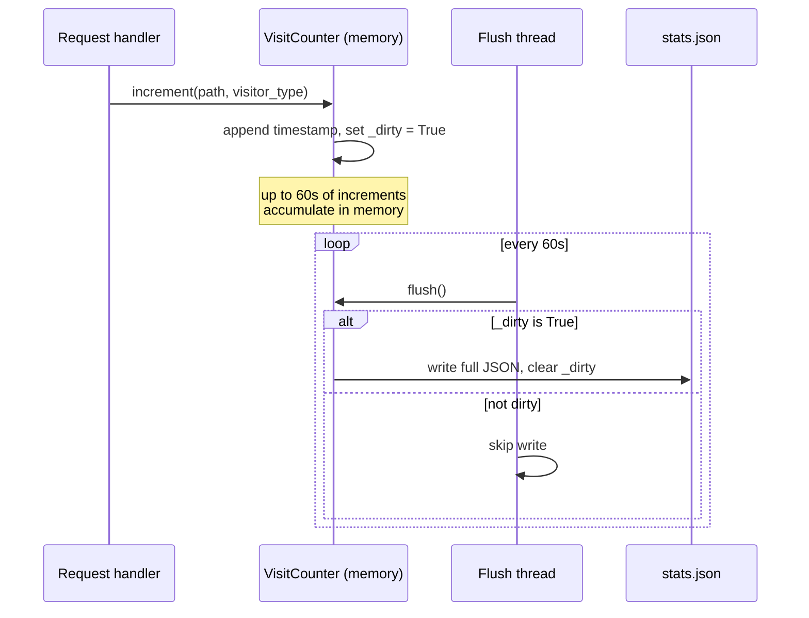

# `stats.py` — A File-Backed Visit Counter

## What this module is for

Every page view on salasblog2 needs to be counted somewhere, and the count
needs to survive process restarts, feed a stats page broken down by time
period, and feed a "which posts are unpopular enough to consider dropping"
report (`propose.py`'s `get_proposed_drops`, gated by a configurable
`drops_min_visits` threshold). `stats.py` is the entire answer to "where do
visit counts live and how do they get there": no database, no external
service — just a JSON file on disk, an in-memory dict guarded by a lock,
and a background thread that flushes periodically.

This is a deliberately small piece of infrastructure for a small blog. The
design only makes sense in that context, and the module's few sharp edges
(below) are the kind that only start to matter once traffic, deployment
topology, or data volume grow past what a single-file, single-process blog
was built for.

## Storage shape: timestamps, not counters

The obvious way to store "how many times was `/blog/foo` visited" is an
integer. `stats.py` instead stores a *list of ISO timestamps* per path, per
visitor type:

```python
# { path: { visitor_type: [ iso_timestamp, ... ], ... }, ... }
```

That's a more expensive representation — a year of steady traffic to a
popular post means a year of timestamp strings sitting in the JSON file —
but it buys something a plain counter can't: **retroactive time-windowed
queries**. Because every visit is a timestamp rather than a tally, "how many
visits did this page get *this week*" is answerable after the fact, without
having needed to know in advance that weekly breakdowns would matter. The
stats page's five tabs (Today / This Week / This Month / This Year / All
Time) all read from the same underlying list; only the filter predicate
changes between them.

The cost of this choice is that the store only ever grows. There's no
pruning, rotation, or downsampling of old timestamps — `stats.json` is
append-only in spirit even though it's rewritten wholesale on every flush.
For a personal blog this is a reasonable trade; it would not scale to a
high-traffic site without some kind of compaction strategy.

## Loading and migrating: reading three formats as one

`_load()` doesn't just parse JSON — it recognizes and upgrades two earlier,
simpler storage formats in place, so that old `stats.json` files written
before this design existed still load correctly:

```python
for path, val in raw.items():
    if isinstance(val, int):
        # oldest format: bare count
        migrated[path] = {"human": ["migrated"] * val}
    elif isinstance(val, dict):
        upgraded = {}
        for vtype, vval in val.items():
            if isinstance(vval, int):
                # middle format: {type: count}
                upgraded[vtype] = ["migrated"] * vval
            else:
                upgraded[vtype] = vval
        migrated[path] = upgraded
```

The technique is worth naming: rather than write a one-time migration
script that transforms the file and bumps a version number, the loader
performs *structural type-sniffing* on every load and normalizes whatever
shape it finds. This is simple and self-healing — there's no migration
step to remember to run — but it does mean the loader pays a type-check on
every path/value on every process start, forever, even years after any
file in the old format could plausibly still exist.

The `"migrated"` sentinel strings are the interesting detail. A bare
integer count carries no timestamp — there's no way to know *when* those
historical visits happened — so the migration invents a list of that
length filled with the string `"migrated"` instead of a real ISO
timestamp. This preserves the *total* count (so `get()` and the "All Time"
view are unaffected) while making those entries silently invisible to any
period-filtered query, since `get_all()` explicitly skips them:

```python
counts[vtype] = sum(
    1 for ts in timestamps
    if ts != "migrated" and _parse_ts(ts) >= cutoff
)
```

That's the correct behavior — a visit with no known date can't honestly be
attributed to "this week" — but it's a subtle enough consequence of the
sentinel choice that it's worth stating explicitly rather than leaving a
future reader to rediscover it.

## Write-coalescing: a background flush thread instead of write-on-write

Writing a full JSON file to disk on every single page view would mean disk
I/O on the hot path of every request — wasteful, and a latent source of
contention if multiple requests increment concurrently. `stats.py` avoids
this with a classic *write-coalescing* (a.k.a. debouncing) pattern: an
`increment()` call only mutates the in-memory dict and sets a dirty flag; a
daemon thread wakes up once a minute and writes the whole file if — and
only if — something changed since the last write.

```python
FLUSH_INTERVAL_SECONDS = 60
...
def flush_loop():
    while True:
        time.sleep(FLUSH_INTERVAL_SECONDS)
        self.flush()
t = threading.Thread(target=flush_loop, daemon=True)
t.start()
```

The tradeoff is explicit and acceptable for this use case: up to 60 seconds
of increments live only in memory, so a hard crash or `kill -9` in that
window loses that window's counts. A graceful shutdown wouldn't lose
anything *if* something called `flush()` on the way down — but nothing in
this module does, so even a clean process exit can drop up to a minute of
data. For a stats counter (not a payments ledger) this is the right amount
of durability to pay for.

## The locking model, and where it doesn't reach

A single `threading.Lock` protects `self._counts`, held during `increment()`
and `flush()`:

```python
def increment(self, path: str, visitor_type: str):
    with self._lock:
        ...
        self._dirty = True
```

That covers the two places the dict is *mutated*. It does **not** cover
`get()` or `get_all()`, both of which iterate `self._counts` without
acquiring the lock at all. Under CPython's GIL this mostly works by
accident — a `for path, types in self._counts.items()` running concurrently
with an `increment()` adding a new key is a known way to trigger `RuntimeError:
dictionary changed size during iteration`, and it's not disallowed by
anything here, just made statistically unlikely by FastAPI's single-process
request handling and the read paths (stats page render, drop proposals)
being infrequent relative to increments. It's a latent bug rather than an
active one today.

The lock also only protects **this process's** view of `_counts`. There's
no file lock around `stats.json` itself. If salasblog2 were ever run with
multiple worker processes or multiple Fly.io machines sharing the same
`/data` volume, each process would keep its own independent in-memory
counts and the periodic flush would simply overwrite whatever the *other*
process last wrote — last-flush-wins, with silent data loss. The module
implicitly assumes a single long-lived process, which matches how it's
deployed today but is worth flagging as a real ceiling.

## Where the file lives: local dev vs. Fly.io volume

```python
data_dir = Path("/data")
if data_dir.exists() and data_dir.is_dir():
    self.stats_file = data_dir / "stats.json"
else:
    self.stats_file = Path("stats.json")
```

`/data` is the conventional mount point for a Fly.io persistent volume.
Checking for its existence rather than reading an environment variable is
a small but pragmatic bit of *environment sniffing*: the same code runs
unmodified in a local dev checkout (where `/data` doesn't exist, so it
falls back to a file next to the working directory) and in production
(where the volume is mounted and survives redeploys). No config flag, no
`if ENV == "production"` branch — the filesystem itself is the source of
truth about which environment this is.

## The singleton and the write-coalescing flow together

`get_counter()` lazily constructs one process-wide `VisitCounter` the first
time it's called and hands out the same instance forever after — the
standard *lazy singleton* pattern, sidestepping needing an app-startup hook
to construct it:

```python
_counter: VisitCounter | None = None

def get_counter() -> VisitCounter:
    global _counter
    if _counter is None:
        _counter = VisitCounter()
    return _counter
```

Putting the pieces together, a single page view's data takes this path
from request to disk:



## A stray import worth noticing

`_period_start()` needs `timedelta` to compute the start of "this week,"
but the module only imports `datetime` and `timezone` at the top. Rather
than add `timedelta` to that import line, it reaches for it inline:

```python
return (now - __import__('datetime').timedelta(days=now.weekday())).replace(...)
```

`__import__('datetime')` re-imports (from Python's cached module table, so
it's cheap) a module that's already imported under the name `datetime` —
functionally harmless, but it reads as an oversight rather than a
deliberate choice, and it's the only place in the file that departs from
ordinary `from datetime import ...` style.

## Observations for future improvement

- **`get()` and `get_all()` should acquire `self._lock`** the same way
  `increment()` and `flush()` do. The current asymmetry is a latent race
  (`RuntimeError: dictionary changed size during iteration`) that just
  hasn't been hit yet because reads are infrequent relative to writes.
- **Multi-process or multi-machine deployment would silently corrupt
  `stats.json`** — there's no cross-process file lock, and the last flush
  to run wins, discarding any counts recorded by other processes since
  their last flush. Worth documenting explicitly as a single-process
  assumption, or fixing with `flock`/atomic rename-on-write, if the
  deployment topology ever changes.
- **Fix the stray `__import__('datetime')` call** in `_period_start()` — add
  `timedelta` to the top-level import and use it directly. Purely
  cosmetic, but it's the kind of oddity that makes a reader wonder if
  there's a reason before realizing there isn't.
- **The timestamp list never gets pruned or compacted.** A post that stays
  popular for years accumulates one string per visit forever, growing
  `stats.json` and the in-memory dict without bound. A rollup strategy
  (e.g., collapsing timestamps older than a year into a per-month count)
  would cap growth while still preserving "this week"/"this month"
  granularity for recent data.
- **Nothing flushes on shutdown.** A clean process exit (not just a crash)
  can still lose up to `FLUSH_INTERVAL_SECONDS` of increments because no
  shutdown hook calls `flush()`. A FastAPI `@app.on_event("shutdown")` (or
  the newer lifespan-context equivalent) wired to `get_counter().flush()`
  would close this gap cheaply.
- **The `"migrated"` sentinel is a clever but undocumented contract** —
  any future code that iterates `_counts[path][vtype]` expecting every
  entry to be a parseable ISO timestamp will silently misbehave on old
  data. A short comment at the point of definition (or better, a named
  constant instead of a bare string literal) would make that contract
  discoverable without having to read `_load()` and `get_all()` together.
