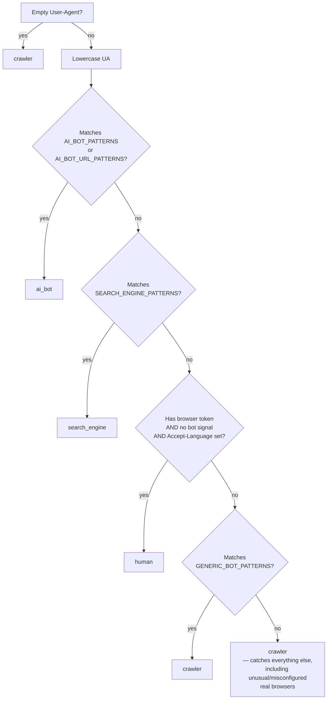

# `visitor_type.py` — Classifying Who's Actually Reading

## What this module is for

`stats.py` counts visits, but a raw hit count on a blog is mostly noise:
search engine crawlers, AI training/inference bots, and assorted scripts
routinely outnumber actual human readers, often by a wide margin. Before a
visit is worth counting as a "real" one — for the stats page, and for
`propose.py`'s decision about which posts are unpopular enough to consider
dropping — something has to decide *what kind of client* made the request.
`classify_visitor()` is that decision, made from nothing but the
`User-Agent` and `Accept-Language` HTTP headers.

There's no external service, no IP reputation database, no JavaScript
challenge — just string matching against curated pattern lists. That's a
deliberately cheap, synchronous, dependency-free approach, and its accuracy
ceiling is exactly what that implies: it catches what identifies itself (or
carries the telltale signs of automation), and nothing more.

## The four categories, and the one that never gets returned

The docstring promises five outcomes — `human`, `ai_bot`, `search_engine`,
`crawler`, or `unknown` — but reading the function to its last line shows
`unknown` is never actually returned; every fall-through path, including
the final one, resolves to `crawler`:

```python
if _has_bot_signal(ua) or has_browser:
    return "crawler"

return "crawler"
```

That's a **stale docstring**, not a bug — the classifier is simply more
decisive than advertised. It's worth calling out because it shapes how to
read everything below: `visitor_type.py` doesn't have a genuine "I don't
know" bucket. Every UA that isn't confidently `human`, a known `ai_bot`, or
a known `search_engine` gets swept into `crawler`, whether it's an actual
crawler, a misbehaving script, or a legitimate-but-unusual browser. This is
a **guilty-until-proven-human** design.

## Why AI bots are checked before browser tokens

The order of checks in `classify_visitor()` is not incidental — it encodes
a real insight about how modern AI crawlers behave. Many identify with a
UA string that *also* contains ordinary browser tokens, precisely so that
naive "does it say Mozilla/Chrome" checks wave them through as human:

```python
# AI bots first — even if they include browser tokens
for pattern in AI_BOT_PATTERNS:
    if pattern in ua:
        return "ai_bot"
```

Because `AI_BOT_PATTERNS` (`gptbot`, `claudebot`, `perplexitybot`, `ccbot`,
etc.) is checked *before* the browser-token/`human` branch, a UA like
`"Mozilla/5.0 (compatible; GPTBot/1.0; +https://openai.com/gptbot)"` is
correctly caught as `ai_bot` even though it contains `Mozilla/5.0`.
Reordering these two checks would silently reclassify every masquerading
AI bot as `human` — the order *is* the logic here, not just a stylistic
choice.

`AI_BOT_URL_PATTERNS` is the fallback for the same problem from the other
direction: bots that don't embed their own name recognizably, but do embed
their homepage domain (`openai.com`, `anthropic.com`, `perplexity.ai`) in
the UA string as a courtesy/attribution convention that's common among
well-behaved crawlers.

## What makes a browser "trusted" enough to call human

Getting to `human` requires clearing three conditions simultaneously, not
just one:

```python
has_browser = any(p in ua for p in BROWSER_PATTERNS)
if has_browser and not _has_bot_signal(ua) and accept_language:
    return "human"
```

1. **A recognizable browser token** is present (`mozilla/`, `chrome/`,
   `safari/`, etc.) — necessary but not remotely sufficient, since bots
   routinely include these too.
2. **No bot signal** is present anywhere in the UA — see below.
3. **`Accept-Language` is non-empty.** Real browsers, per HTTP convention
   and default configuration, always send this header reflecting the
   user's locale settings; command-line tools and simple bot frameworks
   routinely omit it entirely. Its absence is treated as a strong
   standalone signal even when nothing else looks wrong.

That third condition is the least obvious and most consequential design
choice in the module. It means a real person using a real browser that's
been configured (by a privacy extension, a locale-stripping proxy, or an
unusual embedded browser context) to omit `Accept-Language` gets
classified as `crawler`, not `human` — a **false negative** on genuine
traffic. The module accepts this cost deliberately: given the alternative
is systematically over-counting bot traffic as human, undercounting a
small slice of privacy-conscious humans is the safer failure mode for a
stats page whose purpose is roughly "how many real readers am I getting."

## Bot signals: the tells that survive a browser disguise

`_has_bot_signal()` checks for substrings that reveal automation
regardless of what else is in the UA — these are what disqualifies a
UA from `human` even when it has a plausible browser token:

```python
BOT_SIGNALS = [
    "compatible;",        # e.g. "Mozilla/5.0 (compatible; GPTBot/1.0 ...)"
    "headlesschrome", "phantomjs", "puppeteer", "selenium", "webdriver",
    "python-requests", "python-urllib", "python/", "go-http-client",
    "java/", "curl/", "wget/", "libwww", "httpx/", "aiohttp/", "axios/",
    "got/", "node-fetch", "okhttp/", "ruby", "php/", "perl/",
    "+http",
]
```

These fall into two distinct families worth naming separately:

- **HTTP client library fingerprints** (`curl/`, `python-requests`,
  `okhttp/`, `go-http-client`, `axios/`, ...) — every popular HTTP library
  stamps its own name and version into the default UA unless the caller
  overrides it, so this list is really an inventory of "libraries whose
  authors didn't try to look human."
- **Automation-framework fingerprints** — tools that *drive* a real browser
  (`headlesschrome`, `puppeteer`, `selenium`, `webdriver`, `phantomjs`) —
  these produce a UA that otherwise looks completely legitimate (a real
  `Chrome/` or `Safari/` token) and would clear conditions 1 and 3 above;
  only these specific fingerprints catch them.
- **Bot-convention tokens** (`"compatible;"` and `"+http"`) — inherited
  from the old `robots.txt`-era convention of UAs shaped like
  `Mozilla/5.0 (compatible; NAME/VERSION; +http://example.com/bot-info)`.
  Because so many bots — old and new — still follow this template
  verbatim, these two short substrings are disproportionately effective
  despite (or because of) how generic they look.

## Two ways to fall into `crawler`

Once a UA has failed the `human` test, there are still two distinct routes
to a `crawler` classification, and the distinction matters for reading the
code even though it doesn't matter for the output:

```python
for pattern in GENERIC_BOT_PATTERNS:
    if pattern in ua:
        return "crawler"

if _has_bot_signal(ua) or has_browser:
    return "crawler"

return "crawler"
```

`GENERIC_BOT_PATTERNS` (`bot`, `crawler`, `spider`, `scraper`, `monitor`,
`validator`, ...) catches UAs that self-identify with generic bot-ish
words without matching any of the more specific named lists above — this
is the safety net for the long tail of small, unbranded scrapers and
uptime monitors that will never make it into `AI_BOT_PATTERNS` or
`SEARCH_ENGINE_PATTERNS` by name. Everything after that is redundant in
practice — `_has_bot_signal(ua) or has_browser` can only be `True` here for
UAs that already failed the `human` check for lacking `Accept-Language`
(since a bot signal alone would already have been generically bot-like)
— and the bare final `return "crawler"` is what actually handles a UA that
matches literally none of the lists (an obscure or custom client). Given
`unknown` is never used, this final line is effectively that missing
category's job, done silently.

## The classification flow, visualized



The shape of this tree is the real design statement: three chances to be
recognized as *specifically* something (`ai_bot`, `search_engine`,
`human`), and every other path — including total silence about what a
client is — collapses into the same `crawler` bucket. There is no
low-confidence middle ground.

## What this buys, and what it costs

Substring matching against static lists is fast (no regex backtracking
risk, no network calls, sub-microsecond per request) and fully
deterministic — the same UA always classifies the same way, which matters
for a stats page where consistency over time is more valuable than
per-visit precision. It's also the reason the module has zero dependencies
on the rest of the project: it's pure string logic, easy to unit test in
isolation, and easy to reason about.

The costs are the mirror image of the benefits:

- **It only recognizes what's in the lists.** A new AI crawler that
  launches tomorrow with a UA that doesn't match any existing pattern
  sails through as `crawler` (not `human`, thankfully, given the strict
  `human` bar — but not correctly labeled `ai_bot` either) until someone
  notices it in the logs and adds it to `AI_BOT_PATTERNS`. The lists are a
  living document, not a closed classification.
- **It trusts the UA string completely.** Nothing here stops a scraper
  from simply sending a stock Chrome UA plus a plausible
  `Accept-Language` header — at that point it clears every check and is
  counted as `human`. The classifier defends against careless/honest bots
  (the overwhelming majority in practice) and known automation
  fingerprints, not against an adversary specifically trying to blend in.
- **The strict `human` bar has a real false-negative rate** on legitimate
  but atypical traffic — text-mode browsers, some in-app/webview browsers,
  privacy-hardened configurations that drop `Accept-Language`. These
  visits are undercounted as `human` and instead inflate the `crawler`
  bucket, which slightly understates real readership.

## Observations for future improvement

- **Reconcile the docstring with the code.** `classify_visitor()` never
  returns `"unknown"` — every path that isn't confidently `ai_bot`,
  `search_engine`, or `human` resolves to `crawler`. Either the docstring
  should drop `unknown`, or (probably more useful) the final fallback
  should genuinely return `unknown` so downstream consumers can
  distinguish "confirmed bot-like" from "we have no idea," which are not
  the same thing for stats purposes.
- **The two `return "crawler"` branches at the end are functionally
  redundant** with each other in current logic — the penultimate
  `if _has_bot_signal(ua) or has_browser` can be removed with no change in
  behavior, since both its branches return the same value as the line
  after it. Collapsing them would make the "everything else is a crawler"
  policy visually obvious rather than implied.
- **Pattern lists will drift out of date.** New AI crawlers appear
  regularly, and each requires a code change to `AI_BOT_PATTERNS` to be
  recognized. Externalizing these lists (a config file, or a small
  periodically-refreshed data source) would decouple "teach the
  classifier about a new bot" from "ship a code change."
- **No test coverage is visible from this module alone** for the
  intentional edge cases — a UA with `"compatible;"` but also a browser
  token, a UA with no `Accept-Language`, an AI bot UA that also matches a
  `SEARCH_ENGINE_PATTERNS` substring. Given how much the *order* of checks
  matters here, regression tests pinned to that order would guard against
  an innocent-looking reordering silently changing behavior.
- **The classifier is easy to spoof** by design (see costs above). If
  distinguishing real automated scraping from a `human`-labeled bot
  becomes important, that requires signals this module doesn't have
  access to at all — request rate, IP reputation, behavioral patterns
  across requests — none of which belong in a stateless per-request
  UA-string function like this one.
