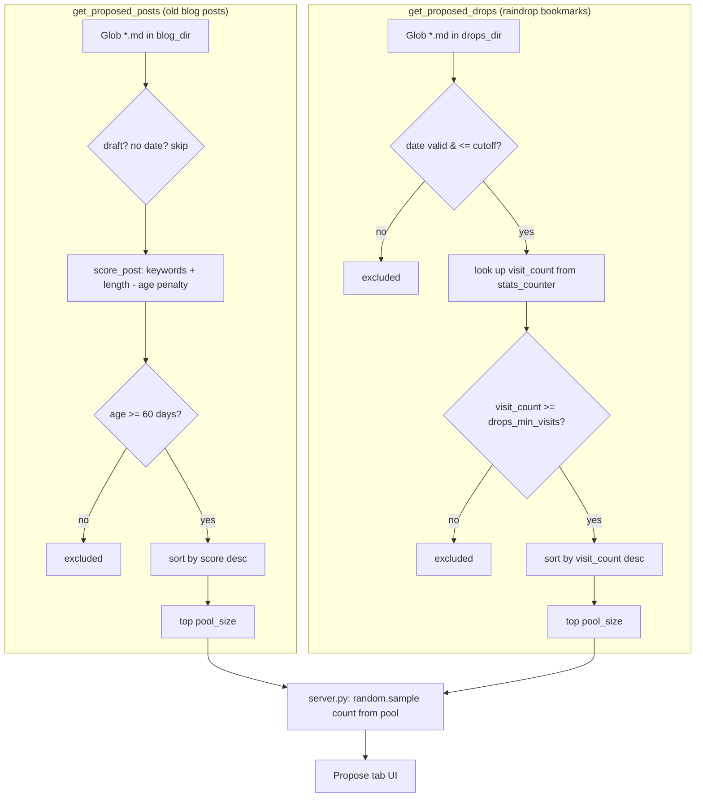

# `propose.py` — Finding Something Worth Writing About

## Why this module exists

A personal blog accumulates two kinds of raw material over time: **old posts** that could be
dusted off and reshared, and **saved links** (Raindrop.io "drops") that were interesting enough
to bookmark but never turned into anything. Both are latent content — useful, but buried. The
admin panel's "Propose" tab exists to surface that latency: instead of the author scrolling
through years of posts and hundreds of bookmarks looking for inspiration, the system does the
scrolling and hands back a short, curated shortlist.

`propose.py` is the brain behind that shortlist. It has no knowledge of HTTP, templates, or the
Claude API — it just reads markdown files off disk, scores or filters them, and returns ranked
lists. That separation matters: the scoring logic can be tested, tuned, and reasoned about
independently of how it's served or displayed.

The module actually solves two related but distinct problems:

1. **Which old blog posts are worth reposting?** (`get_proposed_posts`)
2. **Which saved bookmarks are popular enough to justify writing a new post about?**
   (`get_proposed_drops`)

## Two problems, two strategies

These look similar — both walk a directory of frontmatter'd markdown files and return a ranked
subset — but they answer different questions, and that's reflected in how each one ranks
candidates.

Reposting an old post is a judgment call: is this piece *still relevant*? There's no external
signal for that, so the module invents one — a heuristic **relevance score** built from keyword
matches, content length, and age. Surfacing a popular bookmark is a much simpler question: *did
readers actually visit this?* Real traffic data exists for that (site analytics), so the module
defers to it directly instead of guessing. When you have ground truth, use it instead of a proxy.

## Scoring old posts: `score_post`

The scoring formula is a small, deliberately crude linear model:

```python
def score_post(title: str, content: str, post_date: date, today: date) -> float | None:
    age_days = (today - post_date).days
    if age_days < MIN_AGE_DAYS:
        return None

    text = (title + " " + content).lower()
    keyword_score = sum(
        SCORE_PER_KEYWORD
        for kw in RELEVANCE_KEYWORDS
        if re.search(r"\b" + re.escape(kw) + r"\b", text)
    )
    length_score = len(content) / 100 * SCORE_PER_100_CHARS
    years_old = age_days / 365.0
    age_penalty = min(years_old * SCORE_PER_YEAR_AGO, MAX_AGE_PENALTY)
    return keyword_score + length_score - age_penalty
```

Three signals go into the score, each standing in for something the module can't directly
measure:

- **Keyword matches** (`+10` each, from a fixed `RELEVANCE_KEYWORDS` list of topics like "ai",
  "python", "leadership") act as a proxy for *topical relevance* — is this the kind of thing the
  blog's audience currently cares about? Matching is done with a word-boundary regex
  (`\bkeyword\b`) rather than plain substring search, so "ai" doesn't spuriously match inside
  "again" or "email".
- **Content length** (`+1` per 100 characters) is a proxy for *substance* — a 3,000-word essay
  is more likely worth resurfacing than a two-line link dump, even without reading it.
- **Age** is a *penalty*, not a bonus, capped at `-40` and accruing at `2` points per year old.
  This is the interesting design choice: older posts are worth less, but the penalty is bounded
  so a 20-year-old post isn't infinitely disqualified — it just needs a correspondingly higher
  keyword/length score to surface. The cap prevents age from completely dominating the formula.

There's also a floor, not a ceiling, on age: `MIN_AGE_DAYS = 60`. Anything newer than two months
is excluded outright (`score_post` returns `None`), because reposting something the reader may
have just seen last month defeats the purpose — the whole feature exists to resurrect stale
content, not recently-seen content.

The weights (`10`, `1`, `2`, `40`, `60`) are hand-tuned magic numbers, not derived from any
data. That's fine for a single-author blog with idiosyncratic taste, but it does mean the
ranking reflects the *author's* intuition about what's relevant rather than any measured
outcome (e.g., actual click-through when a repost goes out). There's no feedback loop closing
this — the score is fixed at write time.

## Scoring popular drops: visits, not vibes

`get_proposed_drops` doesn't compute a heuristic score at all — it ranks by real **visit counts**
pulled from the site's own analytics (`stats_counter`), filtered by a minimum threshold and a
minimum age:

```python
def get_proposed_drops(drops_dir: Path, stats_counter, filt: DropFilter) -> list[dict]:
    cutoff = date.today() - timedelta(days=filt.min_age_months * 30)
    results = [
        rec
        for md_file in sorted(drops_dir.glob("*.md"))
        if (rec := _load_drop_record(md_file, stats_counter, cutoff)) is not None
        and rec["visit_count"] >= filt.min_visits
    ]
    results.sort(key=lambda d: d["visit_count"], reverse=True)
    return results[: filt.top_n]
```

The `min_age_months` filter here works in the opposite direction from `score_post`'s age
penalty: it only *excludes* drops saved too recently (`post_date > cutoff`), rather than
progressively discounting older ones. Age is a hard gate for drops (config default is
`drops_min_age_months: 0`, i.e. effectively no gate in production), not a continuous penalty —
because unlike a *repost*, a *new draft* about an old bookmark isn't stale just because the
bookmark is old.

`_load_drop_record` also does a bit of quiet enrichment: it reads a `note` field from
frontmatter, falling back to an embedded `**Notes:**` marker in the body if the frontmatter field
is absent:

```python
def _extract_note_from_body(content: str) -> str:
    """Extract the Notes section from a raindrop markdown body."""
    marker = "**Notes:**"
    idx = content.find(marker)
    if idx == -1:
        return ""
    return content[idx + len(marker):].strip()
```

This is a small piece of format archaeology — it suggests raindrop-sync markdown files evolved
over time (notes used to live in the body, now they live in frontmatter), and this function
bridges both eras so older drops don't lose their notes just because the schema moved on.

`visit_count` is looked up by convention: the drop's stem (`filename` minus `.md`) is assumed to
correspond to a `/raindrops/<stem>.html` page path in the analytics counter. This is an implicit
contract between the raindrop-sync process, the URL routing, and the stats collector — nothing
in this file enforces that the paths actually line up, so a rename anywhere in that chain would
silently zero out visit counts rather than error.

## Configuration-driven thresholds

None of the drop-side thresholds are hardcoded in this module — they arrive via `DropFilter`, a
tiny dataclass:

```python
@dataclass
class DropFilter:
    min_age_months: int
    min_visits: int
    top_n: int
```

The caller (`server.py`) builds this from `config.yaml`:

```yaml
propose:
  pool_size: 50          # candidates fetched before random sampling
  count: 5               # entries shown in the UI
  drops_min_age_months: 0
  drops_min_visits: 5
```

This indirection is worth calling out because it explains a detail that isn't visible from
reading `propose.py` alone: `top_n` here isn't "how many to show the user" — it's `pool_size`,
the size of a *candidate pool*. The server samples `count` (5) items *randomly* from that pool of
up to 50 before displaying them. In other words, `propose.py`'s ranking functions don't decide
what the user sees; they decide the *eligible set*, and randomness on top of that ranking is what
keeps the Propose tab from showing the exact same top-5 every single time it's opened. That
randomization lives outside this file, but it's the reason `get_proposed_posts` and
`get_proposed_drops` are asked for a *pool* rather than a final top-5.

`drops_min_visits: 5` is the load-bearing constant for the drops side: it's a floor on evidence,
not a ranking weight. A drop with 4 visits never enters the pool no matter how old or how well
tagged it is — popularity is treated as a binary gate first, and only a ranking signal second
(via the sort by `visit_count` descending among drops that already cleared the gate).

## Pipeline overview



## Observations for future improvement

- **No feedback loop.** The relevance-score weights (`SCORE_PER_KEYWORD`, `SCORE_PER_YEAR_AGO`,
  etc.) are static and hand-tuned. There's no mechanism to learn from which proposed posts the
  author actually chose to repost, which would be the natural signal to recalibrate the weights.
- **Keyword list is a maintenance burden.** `RELEVANCE_KEYWORDS` is a flat, hardcoded list that
  will drift out of sync with the blog's actual evolving interests unless someone remembers to
  edit it. Deriving it from tag frequency in existing posts would keep it current automatically.
- **Fragile visit-count mapping.** The `/raindrops/<stem>.html` path convention linking drop
  files to analytics rows is implicit and untested; a routing or filename change elsewhere in the
  app would silently drop visit counts to zero (or `None`) rather than raise an error.
- **Two age semantics, one config surface.** `score_post`'s continuous age *penalty* and
  `get_proposed_drops`'s hard age *cutoff* are conceptually different (decay vs. gate), which is
  reasonable given the different questions each answers, but it's a subtlety a future maintainer
  could easily miss when adjusting `drops_min_age_months` expecting post-like decay behavior.
- **`visit_count` can be `None`.** `stats_counter.get(...)` has no documented fallback shown
  here; if it can return `None` for an unseen path, `rec["visit_count"] >= filt.min_visits` would
  raise a `TypeError` rather than treating missing data as zero visits.
- **No dedup between the two pipelines.** If a blog post was itself generated from a raindrop
  drop, nothing prevents both the post and its source drop from being proposed independently in
  the same session.
