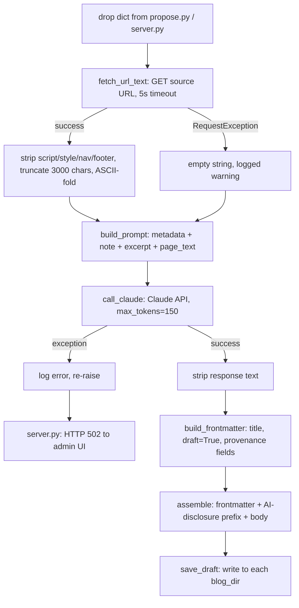

# `draft_generator.py` — Turning a Bookmark into a Paragraph

## Why this module exists

Once `propose.py` has identified a saved link worth writing about, someone still has to write
the sentence. `draft_generator.py` is the module that does that: given a Raindrop bookmark (a
"drop"), it fetches the linked page, hands a compact prompt to the Claude API, and assembles the
result into a ready-to-save markdown draft with frontmatter. It's the one place in the codebase
that talks to an LLM, and it's deliberately narrow in scope — it does not decide *which* drop to
use (that's `propose.py`'s job) or *where* to save the result (that's the caller's, via
`save_draft`). Its only responsibility is: drop in, draft out.

Because this module makes a real network call to a paid external API on every invocation, its
design is shaped as much by *cost and failure containment* as by prompt-writing craft. That's the
throughline worth paying attention to.

## Constraining the problem before asking the model

The single biggest design decision in this file is *scope*: the model is not asked to write a
blog post. It's asked to write **one paragraph, 50–75 words**. This is visible directly in the
prompt template:

```python
def build_prompt(drop: dict, page_text: str) -> str:
    ...
    return f"""Write a single short blog paragraph (50-75 words maximum) about the following link post.
The paragraph must include a markdown hyperlink to the source URL.
Write in first person as the blog author sharing an interesting find.
End naturally — no meta-commentary, no sign-off.

Title: {_ascii(drop['title'])}
URL: {drop['url']}
Domain: {_ascii(drop['domain'])}
Tags: {tags}
Excerpt: {excerpt}
My note: {note}{page_section}

Output only the paragraph text (plain markdown), nothing else."""
```

Narrowing the ask this much pays off in several ways at once:

- **Predictable cost.** A ~75-word target caps output length, which is enforced again
  structurally via `max_tokens=150` on the API call — belt and suspenders against a runaway
  response.
- **Predictable quality risk.** LLMs asked to write a "blog post" tend to drift into generic
  structure (intro, three points, conclusion) that reads as obviously AI-generated. Asking for a
  single first-person paragraph sharing a find is a much narrower, more human-shaped task the
  model reliably does well.
- **A human always edits it anyway.** The draft is saved with `"draft": True` in its frontmatter
  (see `build_frontmatter` below) — it's explicitly a starting point, not a finished post, so the
  prompt optimizes for "good raw material to edit" rather than "perfect prose."

The instruction "no meta-commentary, no sign-off" and "output only the paragraph text" are both
defenses against a common LLM failure mode: prefacing the answer ("Here's a paragraph about...")
or wrapping it in extra formatting. Constraining *output shape*, not just topic, is what makes
`call_claude`'s result usable without further parsing.

## Feeding the model just enough context, and no more

The prompt draws on several sources, layered from cheapest/most-trusted to most-expensive/least-
trusted:

1. **Structured metadata already on hand** — title, URL, domain, tags, excerpt, and the author's
   own saved note. This is free (already on disk from the raindrop sync) and highest-signal: the
   note in particular represents the author's own reaction, which is exactly the voice the
   paragraph should imitate.
2. **Live page text**, fetched fresh via `fetch_url_text`, used only if steps 1's excerpt/note
   aren't sufficient on their own. This costs a network round trip and can fail.

```python
def fetch_url_text(url: str) -> str:
    """Fetch plain text from a URL, returning empty string on any failure."""
    try:
        resp = requests.get(url, timeout=URL_FETCH_TIMEOUT, headers={"User-Agent": "Mozilla/5.0"})
        resp.raise_for_status()
        resp.encoding = resp.apparent_encoding or "utf-8"
        soup = BeautifulSoup(resp.text, "html.parser")
        for tag in soup(["script", "style", "nav", "footer"]):
            tag.decompose()
        text = soup.get_text(separator=" ", strip=True)[:MAX_FETCHED_CHARS]
        return text.encode("ascii", errors="ignore").decode("ascii")
    except requests.RequestException as e:
        logger.warning("Could not fetch %s: %s", url, e)
        return ""
```

A few things are worth noticing here:

- The **5-second timeout** (`URL_FETCH_TIMEOUT`) reflects that this fetch runs synchronously in
  the middle of an otherwise fast admin-panel action. The caller isn't willing to let one slow or
  hanging third-party site block draft generation indefinitely.
- Stripping `script`, `style`, `nav`, and `footer` tags before extracting text is a cheap,
  effective way to avoid feeding the model boilerplate (cookie banners, nav menus) that would
  waste prompt budget and dilute the actual article content.
- The **3,000-character cap** (`MAX_FETCHED_CHARS`) bounds prompt size (and thus cost and
  latency) regardless of how long the source page is — a defense against both runaway token
  spend and needlessly slow requests to the Claude API.
- **Failure is silent and total.** Any `requests.RequestException` — timeout, DNS failure, 404,
  connection reset — collapses to an empty string, logged as a warning. The pipeline doesn't
  distinguish "page temporarily down" from "URL is dead"; either way, the draft generator falls
  back to metadata-only prompting rather than failing the whole operation. This is a reasonable
  choice given the page text is enrichment, not a required input — the note and excerpt alone are
  usually enough to write 50 words.

## Why ASCII-only

Every piece of text going into the prompt is run through `_ascii`, which strips anything outside
the ASCII range:

```python
def _ascii(text: str) -> str:
    return text.encode("ascii", errors="ignore").decode("ascii")
```

This is a blunt instrument — it silently drops legitimate non-ASCII content (accented names,
curly quotes, non-Latin scripts) rather than transcoding it. It reads as a pragmatic guard
against encoding issues corrupting the prompt or the API request (e.g., mismatched page encodings
from `fetch_url_text`, or unusual characters copied into a saved note) rather than a considered
internationalization decision. For an English-language personal blog this is a low-cost
tradeoff, but it's a real one — any source material with non-ASCII text loses that text entirely,
with no fallback transliteration.

## The API call itself: small, direct, and let-it-fail

```python
def call_claude(prompt: str) -> str:
    client = anthropic.Anthropic()
    message = client.messages.create(
        model=CLAUDE_MODEL,
        max_tokens=150,
        messages=[{"role": "user", "content": prompt}],
    )
    return message.content[0].text.strip()
```

There's no retry logic, no streaming, no system prompt — just one user-turn message. That
simplicity is appropriate here: this is a single, low-frequency, human-triggered admin action
(someone clicks "Generate Draft"), not a high-throughput or latency-sensitive pipeline where
retries and backoff would earn their complexity.

`CLAUDE_MODEL` is resolved once at import time via `_load_model`, which reads
`drafts.claude_model` from `config.yaml` (falling back to a hardcoded default). Binding the model
name at import time rather than per-call means changing the model requires a process restart to
take effect — an acceptable tradeoff for a setting that changes rarely, in exchange for not
re-reading a YAML file on every draft generation.

Error handling is intentionally thin and pushed upward:

```python
    try:
        body = call_claude(prompt)
    except Exception as e:
        logger.error("Claude API call failed: %s: %s", type(e).__name__, e)
        raise
```

This catches broadly, logs for diagnosis, and re-raises unchanged — it doesn't try to
distinguish rate limits from auth errors from network failures, and it doesn't retry. The
`except Exception: log, re-raise` idiom here exists purely to get a diagnostic breadcrumb into
the logs before the exception propagates to the caller. In `server.py`, that propagation
ultimately surfaces as an HTTP 502 to the admin UI (`Claude API error: {e}`) — the failure mode
is "tell the human it broke," which is appropriate for a manually-triggered, low-volume action
with no automated fallback path.

## Assembling the final file

The generated paragraph alone isn't a publishable artifact — it needs frontmatter and a
provenance note before it's a real blog draft file:

```python
def build_frontmatter(drop: dict, title: str) -> str:
    data = {
        "title": title,
        "date": date.today().isoformat(),
        "type": "blog",
        "draft": True,
        "author": "Claude.ai",
        "source_raindrop": drop["filename"],
        "source_url": drop["url"],
        "tags": drop.get("tags") or [],
    }
    return "---\n" + yaml.dump(data, allow_unicode=True, default_flow_style=False, encoding=None) + "---\n"
```

Two details stand out. First, `"draft": True` is hardcoded — every AI-generated draft starts in
draft state, unpublishable until a human reviews and flips it, which is the safety net that
justifies the loose, unreviewed prompt-to-publish pipeline above it. Second, `"author":
"Claude.ai"` and `source_raindrop`/`source_url` bake **provenance** directly into the file: it's
always traceable, just by opening the markdown, which drop and which system produced a given
draft. That matters for a blog where some posts are human-written and some are AI-assisted — the
distinction shouldn't require checking git blame or a separate log.

The assembled file also gets a visible, reader-facing disclosure line, not just frontmatter
metadata:

```python
    prefix = f"_Generated by AI based on a [link]({drop['raindrop_url']}) saved on {drop['date']}_\n\n"
    return fm + "\n" + prefix + body + "\n"
```

This is a second, independent layer of AI-attribution — one in machine-readable frontmatter
(for tooling), one in italicized prose (for human readers of the eventual post) — reflecting that
disclosure here isn't an afterthought but a first-class requirement of the feature.

## Request flow



## Observations for future improvement

- **No retry or backoff on the Claude call.** A transient rate-limit or network blip fails the
  entire draft generation and surfaces as a 502 to the admin, even though the underlying prompt
  is small and cheap enough that a single automatic retry would likely be safe and low-cost.
- **`_ascii` silently destroys non-ASCII content.** Any accented names, em dashes, curly quotes,
  or non-Latin text in a note, excerpt, or fetched page is dropped rather than normalized —
  worth revisiting with proper Unicode handling (e.g. NFKD normalization) if the blog ever covers
  non-English sources.
- **`fetch_url_text` failures and "page fetched but irrelevant" look identical downstream.**
  Silently returning `""` on any request exception means there's no signal distinguishing "site
  down" from "site blocks scrapers" from "succeeded but content was boilerplate" — all just
  produce a metadata-only prompt.
- **Model name is cached at import time.** Changing `drafts.claude_model` in `config.yaml`
  requires a process restart to take effect, which could be surprising during iteration on model
  choice.
- **No token/length guard on the model's response beyond `max_tokens=150`.** If the model ignores
  the "50-75 words" instruction and runs long, the response is simply truncated mid-sentence by
  the token cap rather than being validated and possibly retried with a stricter prompt.
- **Title is taken verbatim from the drop, not from the generated paragraph.** `generate_draft_from_drop` uses `drop["title"]` for the post title unconditionally — if the bookmark's saved title is poor (truncated, clickbait, non-descriptive), nothing in this pipeline improves it, even though the model has just written relevant prose that could inform a better one.
