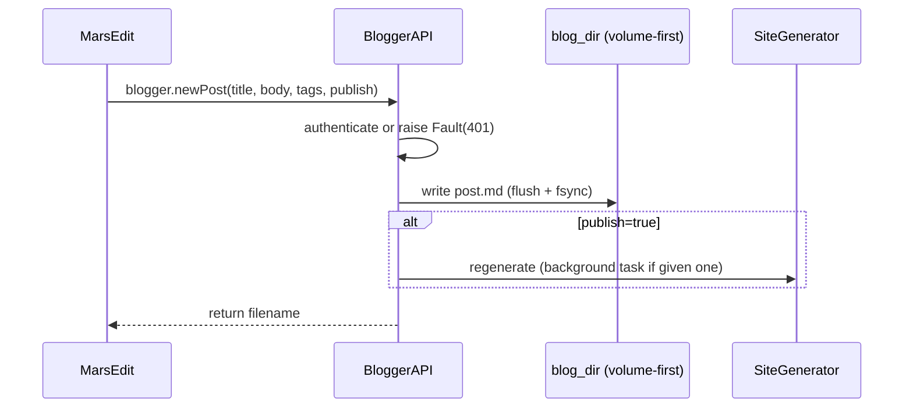

# `blogger_api.py` — MarsEdit Over XML-RPC

## What this module is for

Salasblog2's primary authoring surface is its own web admin panel — but the
project also wants to support **MarsEdit**, a dedicated Mac blogging client
that many writers prefer for offline drafting, image handling, and a proper
text editor. MarsEdit doesn't know anything about this project's REST routes;
it only speaks two aging but still-common XML-RPC dialects: the **Blogger
API** and the **MetaWeblog API**. `blogger_api.py` is the adapter that makes
this Python/FastAPI blog look, from MarsEdit's point of view, like a server
those protocols were designed for.

The module doesn't parse or build XML itself — that job belongs to
`server.py`'s `/xmlrpc` route, which now uses Python's standard-library
`xmlrpc.client` for marshalling (see the `05-server.md` companion doc for
why that mattered). `blogger_api.py` picks up cleanly-typed Python
arguments and does the actual work: write a post, read a post, delete a
post, upload an image — using the same content-directory conventions as the
rest of the site.

## Two protocols, one implementation

Blogger API and MetaWeblog API overlap heavily but differ in two ways: an
`appkey` parameter Blogger requires and MetaWeblog doesn't, and the shape of
the "content" argument (Blogger historically expects a single string;
MetaWeblog expects a `struct` with named fields like `title`,
`description`, `mt_keywords`).

Rather than implement both protocols in full, `BloggerAPI` implements the
Blogger methods as the *real* logic, and gives each MetaWeblog method a
one-line wrapper that just injects a placeholder `appkey` and delegates:

```python
def metaweblog_newPost(
    self, blogid: str, username: str, password: str, struct, publish: bool,
    *, background_tasks=None,
) -> str:
    """MetaWeblog API newPost - maps to blogger_newPost with added appkey"""
    return self.blogger_newPost(
        "metaweblog", blogid, username, password, struct, publish,
        background_tasks=background_tasks,
    )
```

This is the *adapter pattern* in its simplest form: one canonical
implementation, two thin protocol-shaped faces on top of it. The read-only
`metaweblog_get*` methods go a step further and *reshape the response*,
since MetaWeblog's field names differ from Blogger's (`description` vs.
`content`, plus a `categories` array Blogger doesn't return — populated
from each post's real frontmatter `tags`, not a placeholder). Both
`blogger_getPost`/`blogger_getRecentPosts` also include a `link` field —
the post's live permalink — which MarsEdit's Link field reads directly.
This started life as a hardcoded `["General", "Technology"]` stub returned
by `metaweblog_getCategories` regardless of what tags a post actually had
(this blog doesn't use a fixed category taxonomy — see F42 — so those two
values meant nothing); found and fixed during F44's manual MarsEdit
verification, alongside the missing `link` field.

## Content parsing: string or struct, decide at the door

Because a request might arrive from either protocol, `content` can show up
as a bare string (old Blogger style — the whole post crammed into one
field) or a `dict`/struct (MetaWeblog style — separate `title`,
`description`, `mt_keywords`). `_parse_content_or_struct()` is the single
place that decides which shape it got and normalizes both into the same
`(title, body, tags)` triple every caller downstream can rely on:

```python
def _parse_content_or_struct(self, content) -> tuple[str, str, list]:
    if isinstance(content, dict):
        title = content.get("title", "Untitled Post")
        body = content.get("description", content.get("content", ""))
        raw_tags = content.get("mt_keywords", content.get("tags", ""))
        ...
    elif isinstance(content, str):
        title, body = self._parse_content(content)
        return title, body, []
```

`tags` gets the same double-shape treatment: MarsEdit's `mt_keywords` field
can be a comma-separated string *or* an array, depending on client and
transport version. The code checks `isinstance(raw_tags, str)` and only
splits on commas in that case — passing an already-split list straight
through. This kind of defensive type-checking at a protocol boundary is
exactly where it belongs: once `_parse_content_or_struct()` returns, nothing
else in the module needs to think about MarsEdit's quirks again.

For the plain-string Blogger fallback, `_parse_content()` makes a heuristic
guess at where the title ends and the body begins — first checking for an
explicit `<title>...</title>` wrapper, then falling back to "is the first
line short and unpunctuated enough to be a title." It's a guess, not a
parse, and the docstring says so; there's no format here that guarantees a
correct split.

## The write pipeline: straight to the volume, then regenerate

Creating or editing a post is a two-stage pipeline:



**Why fsync?** `_write_post_file()` calls `f.flush()` then
`os.fsync(f.fileno())` before returning. A plain `write()` can leave data
sitting in the OS page cache; if the container were to crash a moment
later, the post could simply not exist on disk despite the write call
having "succeeded." `fsync` forces the write to durable storage before
`blogger_newPost` moves on to the next stage — a small cost paid once per
post, in exchange for not silently losing content a user just typed.

**Where did the volume-backup step go?** Earlier versions of this module
wrote to a local `content/blog/` directory first, then made a second,
explicit copy to `/data/content/blog` (`_backup_to_volume()`) so the post
survived container restarts — with a failure there raising `Fault(500)` so
MarsEdit couldn't tell the author "success" for a post that actually
existed only in the container's ephemeral filesystem (documented in this
project's history as F34). That two-copy design created a subtler problem:
`BloggerAPI` still *read* posts back from the local copy, not the volume,
so a post edited through the web admin (which writes straight to
`/data/content`) was invisible to MarsEdit until the next scheduled GitHub
sync, and a container restart between a MarsEdit edit and the next MarsEdit
read would revert the local copy to the last-pushed git commit while the
volume (and the live site) kept the newer version — MarsEdit would show a
stale post even after refreshing. The fix folds `__init__`'s directory
resolution into the same volume-first check `get_content_directory()`
(`server.py`) and `SiteGenerator` (`generator.py`) already use, so
`blog_dir` *is* `/data/content/blog` in production — one location, written
and read consistently, with no second copy to fall out of sync and nothing
left to explicitly back up after the fact.

**Why is regeneration backgroundable?** Every publish triggers
`generator.incremental_regenerate_post()`, which rewrites the individual
post page, the blog listing, the home page, and the search index — real
I/O against thousands of existing files. Done synchronously, that's what a
MarsEdit user experiences as "Post button hangs for several seconds."
`_regenerate_and_verify()` accepts an optional FastAPI `background_tasks`;
when the XML-RPC route supplies one, regeneration runs *after* the
response is already on the wire, so MarsEdit gets its "success" reply
immediately and the site catches up a moment later:

```python
def _regenerate_and_verify(self, filename, operation, background_tasks=None):
    if background_tasks is not None:
        background_tasks.add_task(self.do_regenerate_and_verify, filename, operation)
    else:
        self.do_regenerate_and_verify(filename, operation)
```

The trade-off is honest, not hidden: a background regeneration failure can
no longer be reported back to the caller as a fault, because the response
already went out. `do_regenerate_and_verify()` still checks that every
expected output file exists afterward and raises if not — but when running
in the background, that raise only reaches the log, not the user. This is
the same responsiveness-over-strict-confirmation trade this project makes
elsewhere (the web admin form's save button behaves identically).

## Local-only vs. production: `Path("/data/...")` existence checks

The Fly.io deployment mounts a persistent volume at `/data`; a laptop
running the server locally has no such thing. Two places in this module
need to know which environment they're in:

- `__init__` checks `Path("/data/content").exists()` to decide whether
  `blog_dir` resolves under the volume or under `root_dir/content` — the
  same volume-first check `get_content_directory()`/`SiteGenerator` use.
- The image-upload path in `metaweblog_newMediaObject()` separately checks
  `Path("/data").exists()` before attempting its own volume-backup copy of
  an uploaded image (media intentionally lives in three places at once —
  source, served output, and volume backup — for different reasons, unlike
  post content, so this check wasn't folded into the same `__init__`
  resolution).

```python
if not Path("/data").exists():
    logger.info(f"No /data volume present (local dev) — skipping media backup for {filename}")
    return
```

This mirrors a pattern already used by `generator.py` and `raindrop.py` for
detecting whether `/data/content` is the active content source. The
specific bug this fixed, historically: on macOS, attempting to *create*
`/data` (which doesn't exist there) fails with `EROFS — Read-only file
system`, because the machine's root filesystem is a sealed, read-only
system volume — so any code path that unconditionally tried a `/data` copy
failed hard on a developer's laptop, even though the rest of the operation
had already succeeded.

## Authentication: two tiers, one deliberately loose

`_authenticate()` checks the supplied username/password against
`BLOG_USERNAME`/`BLOG_PASSWORD` environment variables — and if those don't
match, falls back to accepting *any* non-empty username and password:

```python
fallback_auth = bool(username and password)
```

This is explicitly a development-mode convenience (the log message says as
much), but it applies unconditionally — there's no environment check
distinguishing "running locally" from "running in production." Anyone who
knows the XML-RPC endpoint exists can authenticate with literally any
non-empty credentials. See the closing observations below.

## Error reporting: `Fault` as the one true error channel

Every public method funnels failures through `_create_fault()`, which logs
and raises `xmlrpc.client.Fault(code, message)` — never a bare `Exception`,
never a silent `return None`. This matters because `Fault` is the only
exception type the XML-RPC layer (`server.py`) knows how to translate back
into something MarsEdit's UI can actually display with the right error
code. A generic exception reaching that layer still gets converted to a
`Fault`, but with a hardcoded `500` and no semantic meaning — so
`blogger_getPost()`'s 404-with-a-"did you mean" hint, or
`_authenticate_or_raise()`'s 401, are only useful to the end user because
they're raised as *specific* faults at the point where the specific
context (which post, which credential) is still available.

## Observations for future improvement

- **The open-fallback authentication should be gated on environment**, not
  applied unconditionally. A `PRODUCTION`/`ENVIRONMENT` check (or simply
  requiring `BLOG_USERNAME`/`BLOG_PASSWORD` to be set at all in production)
  would close a real, currently-live gap: any client that knows the
  endpoint exists can authenticate with arbitrary non-empty credentials.
- **The `try/except Exception: logger.error(...); # Don't raise` pattern
  around regeneration appears three times** (create, edit, delete) with
  identical shape. A small context manager or decorator
  (`@best_effort_regenerate`) would remove the duplication and make the
  "regeneration failure never fails the whole request" policy visible in
  one place instead of three.
- **`_parse_content()`'s title/body heuristic for plain-string Blogger
  payloads is a guess**, not a real parse — a post whose first line happens
  to be a long sentence ending in a period gets no title at all, silently
  falling through to the generic `"Blog Post"` title. Given MetaWeblog's
  structured `struct` form is strictly better and is what MarsEdit actually
  sends in modern use, this fallback path may be closer to dead code than
  load-bearing logic — worth auditing against real traffic before investing
  further in it.
- **Excerpts on listing/home pages are generated independently of this
  module** (`utils.py`'s `create_excerpt_with_info()`), by collapsing a
  post's raw markdown into one line and truncating by character count. Two
  related bugs surfaced during the same MarsEdit verification pass —
  truncation cutting mid-`**bold**`/`[link](url)`/`<tag>`, and collapsing
  newlines before truncating turning a correctly-formatted `## Heading`
  into literal `##` text — both now fixed, but worth noting here since a
  MarsEdit-authored post is exactly what exposed them.
