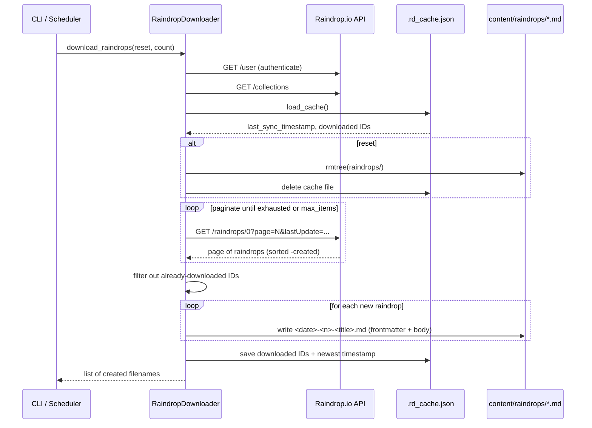

# `raindrop.py` — Syncing the Link Blog from Raindrop.io

## What this module does and why it exists

`salasblog2` is a personal blog, but it also runs a *link blog*: a stream of short posts,
each one a bookmark with a title, URL, tags, and a bit of commentary. Rather than
authoring these by hand, they are pulled from [Raindrop.io](https://raindrop.io), a
bookmarking service the author already uses day-to-day. `raindrop.py` is the bridge
between that external service and the blog's own content model — it is the only place
in the codebase that speaks the Raindrop.io REST API.

Its job, concretely, is threefold:

1. **Fetch** bookmarks ("raindrops") from the Raindrop.io API, page by page.
2. **Translate** each raindrop's JSON shape into this project's markdown-with-YAML-frontmatter
   file format, the same format every other content type in the blog uses.
3. **Remember** what has already been synced, so that repeated runs are cheap and don't
   duplicate work — this is the module's caching and incremental-sync logic.

Everything lives inside a single class, `RaindropDownloader`, which is invoked both from
the CLI (`cli.py`'s `sync-raindrops` command) and from the background scheduler
(`scheduler.py`'s periodic `sync_raindrops` job) and thus has to work equally well as a
one-shot manual operation and as an unattended, recurring task.

## The shape of a sync: one method, three phases

The public entry point is `download_raindrops()`. Structurally it does exactly what the
introduction promised — fetch, translate, remember — and each phase is delegated to a
private helper so the top-level method reads like a table of contents:

```python
def download_raindrops(self, reset=False, count=None, rebuild_cache=False):
    ...
    new_drops, downloaded_ids = self._determine_sync_mode(reset, count, cache)
    ...
    created_filenames = self._write_raindrops_to_files(new_drops, collection_names)
    ...
    self._update_cache(cache, new_drops, downloaded_ids, reset)
    return created_filenames
```

Everything downstream in this document maps onto one of these three phases. Before any
of it runs, `authenticate()` does a cheap sanity check — a `GET /user` call — mostly to
fail fast with a clear error message ("`RAINDROP_TOKEN` environment variable not set…")
rather than let a malformed request fail deep inside pagination logic.

The whole method is wrapped in a single broad `try/except` that prints the error and
returns an empty list rather than raising. This is a deliberate choice for a background
job: a scheduler that fires every couple of hours should log a hiccup and try again
later, not crash the process. It does mean callers can't distinguish "nothing new" from
"the sync failed" — both come back as `[]` — which is worth knowing if you're debugging
why a scheduled sync appears to have done nothing.

## Fetching: pagination and the timestamp watermark

Raindrop.io's list endpoint (`GET /raindrops/0`, where `0` means "all collections") is
paginated at a fixed page size (`DEFAULT_PAGE_SIZE = 50`). `_fetch_page()` wraps a single
page request; `fetch_raindrops()` is the loop that walks pages until it runs out of
items or hits a caller-supplied `max_items` cap:

```python
while True:
    ...
    raindrops = self._fetch_page(page, perpage, since_timestamp)
    if not raindrops:
        break
    ...
    all_raindrops.extend(raindrops)
    page += 1
    if max_items and len(all_raindrops) >= max_items:
        break
```

Two details are worth calling out:

- **No explicit rate-limit handling.** The module doesn't inspect Raindrop.io's
  `X-RateLimit-*` headers or back off on 429s — a non-200 response from `_fetch_page`
  simply raises, which the outer loop's `try/except` turns into "stop fetching for this
  run." For a job that runs every couple of hours and fetches at most a few hundred
  items, this is a reasonable simplification, but it means a rate-limited response looks
  identical to a genuine failure.
- **Descending sort as an early-exit signal.** Every page is requested with
  `sort: "-created"` (newest first). This is what makes incremental sync cheap: since
  items arrive newest-to-oldest, the loop can stop as soon as it sees an item older than
  the last sync watermark, instead of paging through the entire collection every time.

That early-exit is the block right after the fetch:

```python
if since_timestamp and raindrops:
    oldest_in_page = min(raindrops, key=lambda x: x["created"])["created"]
    if oldest_in_page < since_timestamp:
        filtered_raindrops = [r for r in raindrops if r["created"] >= since_timestamp]
        all_raindrops.extend(filtered_raindrops)
        break
```

Note this is a **local, defense-in-depth filter** on top of the API's own
`lastUpdate` query parameter (set in `_fetch_page` when `since_timestamp` is given) — the
server is already asked to filter, and the client filters again. Belt-and-suspenders
against clock skew or an API that doesn't filter as strictly as documented.

## The three sync modes

`_determine_sync_mode()` is the heart of the module's incremental-sync design. It looks
at the cache and the `reset` flag to decide *how much* to fetch and *what counts as new*:

```python
if reset:
    raindrops = self.fetch_raindrops(max_items=count)
    return raindrops, set()

last_sync = cache.get("last_sync_timestamp")
downloaded_ids = set(cache.get("downloaded", []))

if last_sync:
    raindrops = self.fetch_raindrops(max_items=count, since_timestamp=last_sync)
    new_drops = [r for r in raindrops if str(r["_id"]) not in downloaded_ids]
    return new_drops, downloaded_ids
else:
    fetch_limit = count * FETCH_MULTIPLIER if count else DEFAULT_FIRST_SYNC_LIMIT
    raindrops = self.fetch_raindrops(max_items=fetch_limit)
    new_drops = [r for r in raindrops if str(r["_id"]) not in downloaded_ids]
    if count is not None and count > 0:
        new_drops = new_drops[:count]
    return new_drops, downloaded_ids
```

There are, in effect, three distinct modes:

- **Reset (full resync).** Every raindrop is treated as new; nothing is deduplicated
  against history. Used when the author wants to rebuild the link blog from scratch
  (`--reset` on the CLI), typically after a formatting change to `format_raindrop_as_markdown`.
- **Incremental (steady state).** Fetch only items created since `last_sync_timestamp`,
  then filter again against the `downloaded` ID set. This double-filter (timestamp *and*
  ID set) is what makes the sync **idempotent** — running it twice in a row with no new
  bookmarks does nothing, and even a raindrop whose `created` timestamp happens to equal
  the watermark exactly won't be re-downloaded if its ID is already known.
- **First sync (no cache yet).** There's no watermark to filter by, so it grabs a bounded
  batch of recent items instead of the entire account history. If the caller asked for a
  specific `count`, it over-fetches by `FETCH_MULTIPLIER` (2x) to leave room for any IDs
  that turn out to already be downloaded — cheap insurance against under-shooting the
  requested count because of duplicates.

The **watermark** (`last_sync_timestamp`) plus a **seen-ID set** together form a fairly
standard incremental-sync pattern: the timestamp narrows what the API needs to return,
and the ID set is the ground truth for what's actually been materialized on disk. Relying
on the timestamp alone would be fragile — pagination edge cases or clock differences
between client and server could let an item slip through — so the ID set is the real
deduplication mechanism, and the timestamp is purely a fetch-cost optimization.

## From Raindrop JSON to blog markdown

Raindrop.io returns a JSON object per bookmark with fields like `_id`, `title`, `link`,
`tags`, `created`, `collection` (a nested `{"$id": ...}` reference), `domain`, `cover`,
and so on. This module doesn't do the JSON→markdown conversion itself — that logic lives
in `.utils` (`format_raindrop_as_markdown` and `generate_raindrop_filename`) — but
`raindrop.py` is responsible for enriching the raw API payload before handing it off, and
for the file-naming and write mechanics.

The one piece of data enrichment that happens here rather than in `utils` is resolving
the raindrop's collection ID into a human-readable name, because that requires a second
API call (`get_collections()`) that only this module has access to:

```python
if raindrop.get('collection') and isinstance(raindrop['collection'], dict):
    collection_id = raindrop['collection'].get('$id')
    if collection_id and collection_id in collection_names:
        raindrop['collection_name'] = collection_names[collection_id]
```

`get_collections()` itself fetches once per sync run and fails soft — a non-200 response
or exception just logs a warning and returns `{}`, so a hiccup fetching collection names
degrades to posts without a collection label rather than aborting the sync.

Downstream, `format_raindrop_as_markdown` (in `utils.py`) maps this enriched dict onto a
YAML frontmatter block with fields like `date`, `title`, `url`, `tags`, `type: "drop"`,
`raindrop_id`, `domain`, `cover`, `important`, `broken`, and `collection`/`collection_id`.
The `raindrop_id` field deserves special mention: it round-trips back into this module as
the durable identity used for deduplication (see `rebuild_cache_from_files()` below), so
the on-disk file is not just a rendering of the API data — it is also, incidentally, the
cache's backing store of record.

## Filenames as a second layer of idempotency

`generate_raindrop_filename()` builds names like `26-09-08-3-some-article-title.md` — a
date, an incrementing counter, and a sanitized title slug. `_write_raindrops_to_files()`
uses this alongside an explicit existing-files check:

```python
existing_files = {f.name for f in self.drops_dir.glob("*.md")}
...
if filename in existing_files:
    print(f"  [{i}/{len(new_drops)}] Skipping existing: {filename}")
    counter += 1
    continue
```

This is a belt-and-suspenders duplicate check, layered *underneath* the ID-based
deduplication already done in `_determine_sync_mode()`. It matters because the filename
is deterministic given `(date, counter, title)` but the counter is scoped to a single
call to `_write_raindrops_to_files()`, not to the whole `drops_dir` — so in principle two
separate sync runs on the same day could independently produce a raindrop numbered `1`.
This check is what prevents that collision from silently overwriting an existing post.

## The cache: what it stores and why

The cache is a single small JSON file, `.rd_cache.json`, holding two things:

```json
{
  "last_sync_timestamp": "2026-09-01T12:00:00Z",
  "downloaded": ["abc123", "def456", "..."]
}
```

`load_cache()` and `save_cache()` are straightforward, with one twist: an environment
variable, `RAINDROP_LAST_SYNC`, can **override the timestamp** read from the cache file
(but never the downloaded-ID set):

```python
env_timestamp = os.getenv("RAINDROP_LAST_SYNC")
if env_timestamp and env_timestamp != cache_timestamp:
    cache_timestamp = env_timestamp
```

This gives an operator a manual escape hatch — force a resync from an arbitrary point in
time without deleting the whole cache file — while still protecting against
re-downloading items whose IDs are already known. It's a small but telling design choice:
the timestamp is treated as a *hint* that's safe to override, while the ID set is treated
as ground truth that isn't.

### Cache invalidation and recovery

Two operations reset or repair the cache:

- **`reset_data()`** deletes the entire `raindrops/` directory and the cache file — a
  full nuke, used for `--reset`. After this, the next sync is a "first sync" from the
  API's perspective.
- **`rebuild_cache_from_files()`** is the recovery path for when the cache file is lost
  or out of sync with reality (e.g. files were manually added or the cache was deleted
  but the markdown files weren't). It re-derives the downloaded-ID set by scanning every
  `*.md` file in `drops_dir` and pulling `raindrop_id:` back out of the frontmatter:

```python
if 'raindrop_id:' in content:
    for line in content.split('\n'):
        if line.strip().startswith('raindrop_id:'):
            raindrop_id = line.split(':', 1)[1].strip().strip('"\'')
            if raindrop_id:
                downloaded_ids.add(raindrop_id)
            break
```

This is a hand-rolled, single-line frontmatter parser rather than a proper YAML parse —
notably brittle if a `raindrop_id` value were ever multi-line or contained a colon in an
unexpected place, though in practice the field is always a simple numeric ID. It works
because the markdown files are themselves the durable source of truth; the cache is only
an accelerator, and this function is the proof that it can always be reconstructed from
first principles.

## Volume-first storage — and a discrepancy worth flagging

The project's established pattern is that `/data/content` (a persistent Fly.io volume)
is the source of truth in production, with `/app/content` as a git-baked fallback for
local development. This module follows that pattern for choosing *where* `raindrops/` and
`.rd_cache.json` live:

```python
volume_content_dir = Path("/data/content")
if volume_content_dir.exists():
    content_dir = volume_content_dir
else:
    content_dir = Path.cwd() / "content"
```

One discrepancy: the fallback here is `Path.cwd() / "content"` (current working
directory), whereas the pattern described elsewhere in the project refers to a
`/app/content` baked into the Docker image. In practice these likely resolve to the same
directory when the process's working directory is the app root, but the module doesn't
reference `/app/content` explicitly — it trusts `cwd`. That's a subtle coupling to how
the process is launched, worth confirming holds true from every entry point (CLI,
scheduler, tests) that constructs a `RaindropDownloader`.

## Sync flow



## Observations for future improvement

- **Relative import.** `raindrop.py` imports via `from .utils import ...`, but the
  project's style guide (`.claude/style_guide.md`) states "Absolute imports only; no
  relative imports." Several other modules (`cli.py`, `generator.py`, `scheduler.py`)
  share this violation, while `server.py` and `blogger_api.py` correctly use
  `from salasblog2.utils import ...` — worth a sweep across the package, not just this
  file.
- **Silent failure mode.** `download_raindrops()` catches all exceptions and returns
  `[]`, which is indistinguishable from "nothing new to sync." Callers (especially the
  scheduler) can't currently tell a healthy no-op sync from an API outage without reading
  logs; a richer return type (or a raised, caught-at-the-boundary exception) would make
  failures observable.
- **No rate-limit or retry handling.** A 429 or transient 5xx from Raindrop.io aborts the
  current fetch loop rather than backing off and retrying. Given the periodic scheduler
  will simply try again next cycle, this is low-risk today, but a bad run could still
  lose data if it happens right when `last_sync_timestamp` would otherwise have advanced.
- **Hand-rolled frontmatter parsing in `rebuild_cache_from_files()`.** Scanning for a
  `raindrop_id:` line by string matching, rather than parsing YAML properly (the project
  already depends on a `frontmatter` library, used elsewhere), is fragile and duplicates
  parsing logic that exists elsewhere in the codebase.
- **Per-call filename counter.** The `counter` in `_write_raindrops_to_files()` resets to
  `1` on every call rather than being derived from existing files in `drops_dir`, relying
  entirely on the existing-filename check to avoid collisions. Deriving the starting
  counter from what's already on disk would remove the need for that safety net.
- **`content_dir` fallback path.** The local-dev fallback uses `Path.cwd() / "content"`
  rather than an explicit reference matching the `/app/content` convention documented for
  the rest of the project; making this explicit (or sharing a single helper for this
  volume-first resolution across modules) would reduce the risk of drift.
