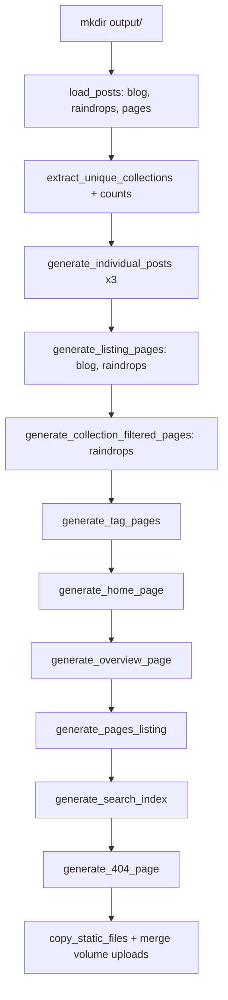
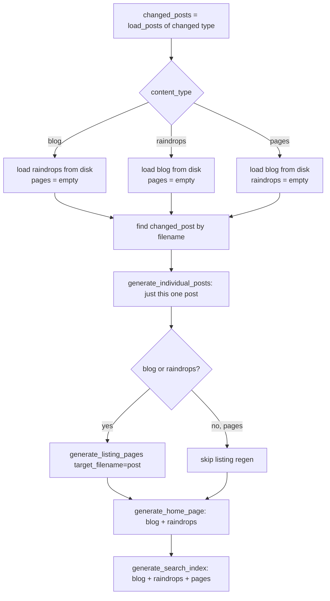

# `generator.py` — The Static Site Builder

## What this module is for

`salasblog2` writes posts as Markdown files with YAML frontmatter, but it
serves plain HTML — no per-request templating, no database query on every
page view. `generator.py` is the bridge between those two worlds: it is
this project's *Hugo*, a `SiteGenerator` class that reads the whole content
tree, renders it through Jinja2 templates, and writes a complete static
`output/` directory that the FastAPI app (`server.py`) then just hands out
as files.

This is the classic **static site generator (SSG)** pattern: pay the cost
of rendering once, at write time, instead of on every visitor's request.
For a personal blog with no per-user personalization, there is no reason
markdown-to-HTML conversion, Jinja2 templating, or pagination math should
ever run inside a request handler — the content only changes when the
author publishes something, so the output can simply be precomputed and
cached as files on disk. `SiteGenerator` is where that precomputation
happens, in two modes: a **full rebuild** (`generate_site()`) that
regenerates everything from scratch, and an **incremental regeneration**
(`incremental_regenerate_post()` / `incremental_regenerate_after_deletion()`)
that touches only the handful of files a single post edit actually affects.

One thing worth flagging up front: `generator.py` imports its helpers with
`from .utils import (...)` — a *relative* import. The project's style guide
(`.claude/style_guide.md`) mandates absolute imports only ("Absolute imports
only; no relative imports"), so this is a small, mechanical style-guide
violation worth fixing (`from salasblog2.utils import (...)`), even though
it causes no functional problem today.

## Two sources of truth: the volume-first content directory

Fly.io deployments mount a persistent volume at `/data`; a plain `git
checkout` of the repo does not have one. `SiteGenerator.__init__` has to
decide, at construction time, which directory actually holds the content
it should read:

```python
volume_content_dir = Path("/data/content")
if volume_content_dir.exists():
    self.content_dir = volume_content_dir
else:
    self.content_dir = self.root_dir / "content"
```

In production, `/app/content` — the copy baked into the Docker image from
git at build time — is **not** the source of truth. Every container boot
runs a `git checkout -f` that would silently discard any post written after
the image was built, so anything living only in `/app/content` is
disposable. The **volume** at `/data/content` is what survives redeploys
and restarts; it's where the web admin panel, the Blogger/MetaWeblog XML-RPC
adapter (`blogger_api.py`), and the raindrop importer all write. This
`Path("/data/content").exists()` check is how `SiteGenerator` finds that
same durable location — it's the identical pattern `blogger_api.py` and
`server.py`'s `get_content_directory()` use, kept consistent on purpose so
that "which directory is real" is never a question two parts of the
codebase answer differently.

Locally, there is no `/data` volume at all — attempting to create one on a
sealed read-only root filesystem (macOS, for instance) fails outright — so
`content_dir` falls back to the repository's own `content/` directory. This
gives local development a working, git-tracked content tree to build
against without needing to fake a volume mount.

## Loading content: `load_posts()`

Everything else in the module operates on Python dictionaries, not on raw
files. `load_posts(content_type)` is the one place that turns Markdown +
frontmatter into that shape, for whichever of the three content types is
asked for — `'blog'`, `'raindrops'`, or `'pages'` — each backed by its own
subdirectory under `content_dir`.

For every file, it delegates the actual frontmatter/Markdown parsing to
`utils.parse_frontmatter_file()` (which in turn wraps the `python-frontmatter`
and `markdown` libraries, with fallbacks for malformed YAML), and then
assembles a `post_data` dict with the fields templates expect: `title`,
`date`, `type`, rendered `content`, `raw_content`, `filename`, `url`,
`tags`, and `image_size`. Two details are worth calling out:

- **Draft posts are filtered out entirely** (`if parsed['metadata'].get('draft'): continue`)
  — they're loaded from disk (so a stray parse error would still be logged)
  but never make it into the returned list, so they can't leak into
  listings, search, or their own individual page.
- **A missing title doesn't get silently defaulted to something innocuous.**
  It becomes a visibly wrong placeholder — `"placeholder title: My Post
  Slug"` — derived from the filename. That's a deliberate "fail loud, not
  quiet" choice: a blank or generic title would be easy to miss on a
  listing page, but `placeholder title: ...` is impossible to mistake for a
  real one, which nudges the author to go fix the frontmatter.

### Raindrops get extra fields, including a hand-rolled note extractor

`raindrops` content (bookmarks imported from the Raindrop.io service) needs
several fields blog posts and pages don't: `cover`, `domain`, `media`,
`important`, `broken`, `collection`, and a free-text `note`. Most of these
come straight from frontmatter, but `note` has a fallback: if the
frontmatter has no `note` field, the loader scans the post body for a
`**Notes:**` marker and collects the lines that follow it, stopping at the
next bold-markup section header:

```python
for line in lines:
    if line.strip() == '**Notes:**':
        note_start = True
        continue
    elif note_start and line.strip().startswith('**') and line.strip().endswith('**'):
        break  # hit another section, stop collecting notes
    elif note_start:
        note_lines.append(line)
```

This is a small, brittle text-scraping heuristic — it exists because
raindrops imported via one code path historically embedded the note inside
the Markdown body rather than in frontmatter, and this keeps those older
files rendering correctly without a one-time migration script. It's exactly
the kind of thing that's fine as a compatibility shim but would be a red
flag if it were the *primary* way notes got into a post going forward.

### Excerpts are computed per content type, not by one universal rule

The `excerpt` field also branches on `content_type`, and the branching is
worth understanding because it reflects a real difference in how each
content type is meant to be skimmed:

| Content type | Excerpt source |
|---|---|
| any type, if frontmatter has one | `excerpt` field verbatim, `is_truncated = False` |
| `pages` | first paragraph of the body (`extract_first_paragraph`) |
| `raindrops` | empty string — the raindrop template renders `note` and the link URL directly instead |
| `blog` | `create_excerpt_with_info()` — a truncated summary, with a flag saying whether truncation happened |

Raindrops deliberately get *no* excerpt from the body, because a raindrop's
Markdown body is mostly raw metadata labels (`**URL:**`, `**Type:**`, etc.)
meant for the individual page, not a marketing-copy summary — showing an
excerpt of that on a listing page would just print label text. Blog posts
are the one type where `is_truncated` matters downstream: listing templates
use it to decide whether to show a "Read more" link.

## Full generation: `generate_site()`

`generate_site()` is the orchestrator for a complete rebuild. It has no
clever logic of its own — its job is sequencing, and that sequencing is the
important part:



A few design choices in this pipeline are worth calling out individually:

- **Content is loaded once, up front**, and every downstream step
  (listings, tag pages, home page, search index) works from the same
  in-memory `blog_posts` / `raindrops` / `pages` lists rather than
  re-reading the disk. This avoids the cost — and the risk of
  inconsistency — of six different steps parsing the same files
  independently.
- **Collections and their counts are precomputed once** and threaded
  through to both `generate_listing_pages()` and
  `generate_collection_filtered_pages()`, since both need the same "how
  many raindrops per collection" numbers to render filter navigation.
- **Static file copying happens last**, and it does more than a directory
  copy: after `shutil.copytree()` from `static/`, it separately merges in
  any images from `/data/static/images/uploads` — the volume location where
  uploaded images persist across redeploys, since a `git checkout -f` on
  boot would otherwise wipe any image uploaded outside of a commit. This is
  the same volume-first idea as content, applied to media.
- **Template rendering failures don't abort the build.** `render_template()`
  catches exceptions, logs them, and returns an empty string rather than
  propagating — so one broken template call produces one blank page instead
  of stopping the entire site generation. That's a defensible trade for a
  batch job that might otherwise fail an entire deploy over one bad post,
  though it does mean a broken page can go live silently (see
  Observations).

## Templates and their custom Jinja2 filters

`SiteGenerator.__init__` builds one shared `jinja2.Environment` (loading
templates from `templates/`) and registers the vocabulary the templates
rely on:

```python
self.jinja_env.filters['strftime'] = self.format_date
self.jinja_env.filters['dd_mm_yyyy'] = lambda date_str: format_date(date_str, '%d-%m-%Y')
self.jinja_env.filters['group_by_month'] = group_posts_by_month
self.jinja_env.filters['markdown'] = self.markdown_to_html
self.jinja_env.filters['slugify'] = slugify_tag
self.jinja_env.filters['slugify_collection'] = slugify_collection
self.jinja_env.globals['NOTE_TRUNCATE_LENGTH'] = 300
```

Most of these just expose an existing `utils.py` function as a filter so
templates can write `{{ post.date | strftime }}` instead of the generator
having to pre-format every date field on every post. The interesting one is
`markdown`: because a raindrop's `note` field is raw, unrendered Markdown
(unlike `post.content`, which `load_posts()` already converted to HTML), the
template needs to convert it inline — `{{ post.note | markdown }}` — using
the exact same `process_markdown_to_html()` used everywhere else, so a bold
marker or link in a note renders identically to one in a post body.

`self.markdown_processor` is also grabbed directly from
`utils.get_markdown_processor()`, which returns a **module-level singleton**
`markdown.Markdown` instance (rather than constructing a new one per call).
`python-markdown` processors are somewhat expensive to configure — they
parse extension chains once — so reusing one instance across every post in
the site, calling `.reset()` between conversions to clear parser state, is
meaningfully cheaper than instantiating one per post across thousands of
files.

## Pagination: computing the page, writing only what's needed

`generate_listing_pages()` is the module's most intricate function, because
it serves two different callers with different needs: a full rebuild that
wants every listing page written, and an incremental update that wants
exactly one.

The pagination math itself is standard fixed-page-size chunking:

```python
posts_per_page = 20
total_posts = len(posts)
total_pages = max(1, (total_posts + posts_per_page - 1) // posts_per_page)
```

The `max(1, ...)` guards the zero-posts case — an empty blog should still
render a valid (empty) listing page, not zero pages and a broken "page 1 of
0" link. The `(total_posts + posts_per_page - 1) // posts_per_page` idiom is
the standard integer-division "round up" trick — computing `ceil(a / b)`
using only integer arithmetic — so a 21st post correctly starts a second
page.

Each page gets a `pagination` context dict with everything the template
needs to render prev/next links and a page-number strip, computed for
*every* page regardless of which ones actually get written to disk:

```python
pagination = {
    'current_page': page_num,
    'total_pages': total_pages,
    'has_prev': page_num > 1,
    'has_next': page_num < total_pages,
    'prev_url': self._get_page_url(content_type, page_num - 1) if page_num > 1 else None,
    'next_url': self._get_page_url(content_type, page_num + 1) if page_num < total_pages else None,
    'page_urls': [self._get_page_url(content_type, p) for p in range(1, total_pages + 1)]
}
```

That distinction — *computing* pagination metadata for all pages but only
*writing* some of them — is exactly what makes incremental regeneration
possible. The first page is always written as `index.html`; every
subsequent page is `page-N.html`, which keeps the site's most common URL
(`/blog/`) clean while still giving every page a stable, linkable address.

### Why incremental regeneration only touches one listing page

This blog's content has grown large enough (the docstring cites 2,817 posts
across 141 pages) that regenerating all 141 listing pages for a single
one-line edit would be wasteful — most of those pages contain nothing that
changed. `generate_listing_pages()` accepts an optional `target_filename`;
when given, it works out which page the edited post actually lives on and
skips writing every other page:

```python
if target_filename is not None:
    bare = target_filename.replace('.md', '')
    try:
        post_index = next(i for i, p in enumerate(posts) if p.get('filename') == bare)
        target_pages = {post_index // posts_per_page + 1}  # 1-based
    except StopIteration:
        target_pages = None  # post not found — fall through to full regen
```

This works because pages are computed from a **freshly sorted, freshly
loaded** `posts` list every time — `post_index // posts_per_page` is only
correct if `posts` is in the same date-descending order the earlier full
pagination loop used, which is guaranteed here because `generate_listing_pages()`
itself re-sorts `posts` by date at its top before either loop runs. There's
an implicit assumption worth naming: **a post edit that doesn't change its
publish date can't move it to a different page**, and generally won't,
since the sort key is `date`. An edit that *does* change the date (e.g.
backdating a post) could shift the post to a different page than the one
that gets regenerated — an edge case the incremental path doesn't detect,
though it would self-correct on the next full `generate_site()` run.

## Incremental regeneration: the fast path

`incremental_regenerate_post()` is what runs after a single post is created
or edited — called from the web admin's save handler, from
`blogger_api.py`'s MarsEdit adapter, and from the raindrop-import flow in
`server.py`. Its entire purpose is to avoid the full-site cost for a
single-post change:



Two economy measures are stacked here:

1. **Only the changed content type is re-read from disk in full.** If a
   blog post changed, raindrops are also loaded (because the home page and
   search index need them), but blog posts are loaded via `changed_posts` —
   already in memory — instead of a second disk read. `pages` is set to
   `[]` for a blog or raindrops edit rather than loaded at all, on the
   assumption that pages are irrelevant to this operation. But that same
   empty list then flows into the search-index rebuild
   (`blog_posts + raindrops + pages`), which means **a blog or raindrop
   edit silently drops existing pages from the regenerated search index**
   — a real gap, not a simplification; see Observations below.
2. **Only the specific listing page containing the edited post is
   rewritten**, via the `target_filename` pagination shortcut described
   above.

The home page and search index are always regenerated in full (not
incrementally), because both are small — a handful of recent posts, or one
JSON file covering the whole site — so there's no meaningful pagination
shortcut available for them; the cost of rebuilding them is already
minimal.

### Deletion: a slightly different shape

`incremental_regenerate_after_deletion()` handles the removal case, and it
looks superficially similar but differs in one important way: **it doesn't
try to load only the changed type**. Every deletion reloads `blog_posts`,
`raindrops`, and `pages` from disk in full, then regenerates the affected
type's listing page with *no* `target_filename` — i.e., a full listing
rebuild for that one content type, not just the page the deleted post used
to occupy:

```python
if content_type in ['blog', 'raindrops']:
    content_posts = {'blog': blog_posts, 'raindrops': raindrops}[content_type]
    self.generate_listing_pages(content_posts, content_type)
```

That's necessary, not an oversight: deleting a post shifts every post after
it in the sort order back by one position, which can shift the page
boundary for posts on *every subsequent page*, not just the page the
deleted post was on. Regenerating one page wouldn't be correct here the way
it is for an edit, where no other post's page assignment changes. Before
regenerating, the function also directly `unlink()`s the deleted post's
individual HTML file — since nothing would otherwise remove it, unlike a
listing page that gets overwritten with fresh content regardless.

## Tag pages and collection-filtered pages

Beyond the primary blog/raindrops/pages listings, the generator builds two
more cross-cutting views:

- **`generate_tag_pages()`** builds one page per unique tag across *both*
  blog posts and raindrops combined — `/tags/<slug>/index.html` — by
  building a `slug -> {name, posts}` map in a single pass over both lists,
  then rendering each. Tags are only ever regenerated as part of a full
  `generate_site()` run; there's no incremental tag-page update, so a
  freshly-tagged post won't show up under its tag page until the next full
  rebuild (or a manual "regenerate site" trigger).
- **`generate_collection_filtered_pages()`** does the raindrops equivalent
  for Raindrop.io "collections" (the folders raindrops were originally
  organized into) — one paginated listing per collection, under
  `/raindrops/<collection-slug>/`. This reuses the same 20-per-page,
  `index.html`/`page-N.html` scheme as the main listings, just scoped to a
  filtered subset of raindrops. Like tag pages, this only runs during a
  full rebuild.

Both of these are naturally more expensive to make incremental than the
main listings — a single post touches at most one tag/collection listing
today, but a *tag* change on an existing post could add or remove it from
one tag page and leave another untouched, which is harder to express as
"regenerate exactly one page" the way date-based listing pagination is.

## The search index

`generate_search_index()` writes one flat JSON file, `output/search.json`,
covering every post regardless of type:

```python
search_item = {
    'title': post['title'],
    'url': post['url'],
    'type': post['type'],
    'excerpt': post['excerpt'],
    'content': post['raw_content'][:500] + '...' if len(post['raw_content']) > 500 else post['raw_content']
}
```

This is a deliberately simple approach: no inverted index, no ranking, just
a JSON array a client-side script can `fetch()` once and search through
with substring or fuzzy matching in the browser. For a blog-sized corpus
(thousands, not millions, of posts), shipping the whole index as one static
file and letting the browser do the searching avoids running any search
infrastructure server-side — consistent with the project's overall
"precompute, don't compute per-request" philosophy. The trade-off is a
larger download and slower search as the corpus grows; at some size this
stops being the right design (see Observations).

## Observations for future improvement

- **A blog/raindrops incremental edit regenerates the search index without
  the `pages` content type.** In `incremental_regenerate_post()`, `pages`
  is set to `[]` whenever `content_type` isn't `'pages'`, and that empty
  list flows straight into `generate_search_index(blog_posts + raindrops +
  pages)` — meaning any edit to a blog post or raindrop overwrites
  `search.json` with all existing *pages* silently removed from search
  results, until the next full `generate_site()` restores them. This looks
  like a real, live bug rather than an intentional trade-off, since nothing
  else in the incremental design suggests pages should be excluded from
  search.
- **Tag pages and collection-filtered pages have no incremental path.**
  Both are only rebuilt on a full `generate_site()` run, so a newly-tagged
  or re-tagged post won't appear under its tag page (or a raindrop's new
  collection page) until a full regeneration happens — which, for a
  frequently-updated blog, could mean tag pages are stale for a while after
  most edits.
- **`render_template()` swallows all exceptions and returns `""`.** A
  broken template renders as an empty (but still 200-status, still linked)
  page rather than failing the build or at least flagging which page needs
  attention. A build-time report of "N pages rendered empty due to errors"
  would surface this instead of only appearing in scroll-away console
  output.
- **Config loading (`config.yaml`, `HOME_POSTS_COUNT`) happens inside
  `generate_home_page()`**, reading and parsing a YAML file from disk on
  every call — including every incremental regeneration, which calls
  `generate_home_page()` on every single post save. Hoisting that read into
  `__init__` (or caching it) would remove a repeated disk read from the hot
  path without changing behavior.
- **The incremental listing-page shortcut assumes date-stable edits.** As
  noted above, editing a post's `date` field can move it across a page
  boundary without the incremental path detecting or handling that case —
  worth either detecting the date change explicitly, or documenting it as a
  known limitation that requires a full regenerate after a backdating edit.
- **The `from .utils import (...)` relative import** violates this
  project's absolute-imports-only style rule and should become `from
  salasblog2.utils import (...)` for consistency with the rest of the
  codebase, even though it has no functional effect today.
