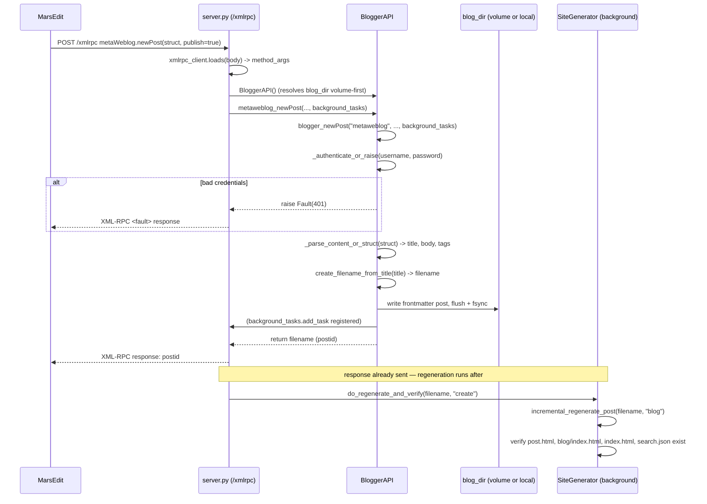

# `blogger_api.py` — the Blogger/MetaWeblog bridge for MarsEdit

## Why this module exists

Salasblog2 already has a web admin panel for writing posts. `blogger_api.py` exists so that isn't the *only* way to write posts: it implements the **Blogger API** and **MetaWeblog API**, two overlapping XML-RPC protocols from the mid-2000s blogging era, so that [MarsEdit](https://redsweater.com/marsedit/) — a dedicated Mac desktop blog editor — can talk to this site as if it were any other blog.

Nothing about the site's actual storage model changes to support this. `BloggerAPI` reads and writes the same Markdown-plus-frontmatter files under `content/blog/` that the web admin panel and `SiteGenerator` use, and it calls the same regeneration machinery to bring the static output up to date afterward. This module is purely a **protocol adapter**: it translates XML-RPC method calls into the same file operations a human would trigger by hand through the browser.

The XML-RPC transport itself — parsing the request body, dispatching to the right method, marshalling the response — lives in `server.py`'s `/xmlrpc` endpoint; `blogger_api.py` only implements the *methods* that endpoint dispatches to. `BloggerAPI` has no knowledge of HTTP, FastAPI, or XML at all — it works entirely in Python strings, dicts, and lists, which is what makes it independently testable.

## Two protocols, one implementation

Blogger API and MetaWeblog API cover the same ground — create, edit, delete, list, and fetch posts — but they aren't identical:

- Blogger's methods all take an `appkey` parameter (a vestige of Blogger's original API-key scheme); MetaWeblog's don't.
- Blogger represents post content as a bare string that the *server* is expected to parse for a title; MetaWeblog passes a structured `struct` (a dict) with explicit `title`, `description`, and `mt_keywords` fields.
- MetaWeblog uses `description` where Blogger effectively expects raw content, and it uses `categories` where this codebase uses tags.

Rather than duplicate the create/edit/delete/read logic twice, the module treats **Blogger's methods as the real implementation** and gives MetaWeblog's methods thin **adapter** wrappers that reshape the call in and the result out:

```python
def metaweblog_newPost(
    self, blogid, username, password, struct, publish, *, background_tasks=None,
) -> str:
    """MetaWeblog API newPost - maps to blogger_newPost with added appkey"""
    return self.blogger_newPost(
        "metaweblog", blogid, username, password, struct, publish,
        background_tasks=background_tasks,
    )
```

The read side does the same reshaping in the other direction — call the Blogger method, then relabel fields for MetaWeblog's vocabulary:

```python
def metaweblog_getPost(self, postid: str, username: str, password: str) -> dict:
    blogger_post = self.blogger_getPost("metaweblog", postid, username, password)
    metaweblog_post = {
        "postid": blogger_post["postid"],
        "title": blogger_post["title"],
        "description": blogger_post["content"],  # MetaWeblog uses 'description' not 'content'
        "dateCreated": blogger_post["dateCreated"],
        "userid": blogger_post["userid"],
        "categories": blogger_post["tags"],
        "link": blogger_post["link"],
    }
    return metaweblog_post
```

This means every bug fix, every authentication rule, and every regeneration-trigger decision only has to be made once, in the `blogger_*` methods. The `metaweblog_*` methods can't drift out of sync with them because they don't contain independent logic — they're pure reshaping.

## One content directory, resolved once

Historically this module wrote new posts to a local directory and then explicitly copied the file over to a persistent Fly.io volume as a second step. That two-step "write local, then push to volume" pattern is exactly the kind of thing that looks harmless and isn't: reads only ever looked at the local copy, so a container restart between an edit and the next read could revert the local copy back to whatever was last baked into the git image, while the volume — and the live site — still had the newer version. MarsEdit could refresh and still show a stale post.

The fix was structural rather than a patch: resolve **one** content directory at `__init__` time, volume-first, and use it for every read and write. This is the same resolution `get_content_directory()` in `server.py` and `SiteGenerator` in `generator.py` already perform, so all three parts of the system agree on where "the post" lives:

```python
def __init__(self):
    self.root_dir = Path.cwd()
    # Volume-first content directory — same resolution as server.py's
    # get_content_directory() and generator.py's SiteGenerator, so a post
    # written here is immediately the same file the web admin and the live
    # site see, with no separate backup/sync step needed to reconcile them.
    volume_content_dir = Path("/data/content")
    content_dir = (
        volume_content_dir if volume_content_dir.exists() else self.root_dir / "content"
    )
    self.blog_dir = content_dir / "blog"
    self.blog_dir.mkdir(parents=True, exist_ok=True)
```

`Path("/data/content").exists()` is doing double duty here: on Fly.io, `/data` is a mounted persistent volume, so the check picks the volume path. In local dev there's no such mount, so it falls back to `content/` under the project root. The check matters even more on **macOS**, specifically: macOS's root volume is sealed (SIP / the read-only system volume), so an attempt to *create* `/data` on a Mac fails with a read-only-filesystem error rather than just "not found." Checking `.exists()` first — rather than trying to write and catching the failure — means local development on a Mac never even attempts the doomed operation.

With a single resolved `blog_dir`, `_write_post_file` can write directly, with an explicit flush and `fsync` so the file is durable on disk the instant the XML-RPC call returns — no separate backup/reconciliation step needed to make the write "count":

```python
def _write_post_file(self, file_path: Path, post: frontmatter.Post):
    """Write post to file with explicit flush to ensure immediate availability."""
    with open(file_path, "w", encoding="utf-8") as f:
        f.write(frontmatter.dumps(post))
        f.flush()
        os.fsync(f.fileno())
```

## Media uploads: three copies, and that's deliberate

`metaweblog_newMediaObject` — the call MarsEdit makes when you drag an image into a post — is the one place in this module that *does* still write three copies of a file. Unlike the post-content case above, this isn't a leftover bug; it's intentional, because each copy answers a different question:

```python
# 1. Source copy — included in git sync
source_dir = self.root_dir / "static" / "images" / "uploads"
...
# 2. Output copy — served immediately without a site regeneration
output_dir = self.root_dir / "output" / "static" / "images" / "uploads"
shutil.copy2(source_path, output_dir / filename)
...
# 3. Volume backup — persists across container restarts. No-op outside
# Fly.io: /data only exists in production.
if Path("/data").exists():
    volume_dir = Path("/data") / "static" / "images" / "uploads"
    shutil.copy2(source_path, volume_dir / filename)
```

The distinction is: post content has exactly one canonical home (hence the fix above), but an uploaded image genuinely needs to exist in three places at once for three different reasons — a copy under `static/` so it's picked up by the normal git-backed asset pipeline, a copy under `output/` so the image renders immediately in the freshly-saved post without waiting for a full site regeneration, and a copy under the Fly.io volume so it isn't lost the next time the container restarts and static assets get reset to what's in the image. Collapsing these into one location the way post content was collapsed would break one of those three guarantees.

Note also that the volume copy is wrapped in its own `try/except` that raises an XML-RPC fault on failure, while the local dev case (`/data` doesn't exist) just logs and moves on — the same volume-first-but-optional discipline as content directory resolution, applied to writes instead of reads.

## Free-form tags, not a fixed taxonomy

Classic Blogger/MetaWeblog assumes a fixed, admin-curated list of **categories**, chosen from a picker. Salasblog2 doesn't work that way — feature F42 established free-form, comma-separated **tags** as the organizing mechanism instead of a closed taxonomy, and `BLOG_TAGS` in `utils.py` is only a *suggestion list* for the web admin's tag field, not an enforced vocabulary. Any string a post's frontmatter uses as a tag is a valid tag.

`metaweblog_getCategories` has to answer MarsEdit's category picker with *something*, so it reuses `BLOG_TAGS` as the suggestions MarsEdit shows — keeping MarsEdit's picker in sync with the same suggestions the web admin offers, rather than presenting an unrelated, hardcoded pair of categories:

```python
def metaweblog_getCategories(self, blogid: str, username: str, password: str) -> list:
    # This blog uses free-form tags, not a fixed category taxonomy (see F42) — BLOG_TAGS
    # is the same curated suggestion list the web admin's tag field offers, so MarsEdit's
    # category picker shows the same suggestions rather than a hardcoded, unrelated pair.
    categories = [
        {
            "categoryId": tag,
            "description": tag,
            "htmlUrl": f"/tags/{slugify_tag(tag)}/index.html",
            "rssUrl": "/blog/rss.xml",
        }
        for tag in BLOG_TAGS
    ]
    return categories
```

Symmetrically, `getPost` and `getRecentPosts` report each post's *actual* tags — read straight from the post's frontmatter — as its MetaWeblog `categories`, and each post's real permalink as its `link`, both computed with `generate_url_from_filename`. Earlier versions of these methods returned hardcoded placeholder values for both fields; reading the real values means MarsEdit's post list and the "Categories" field it shows when you open a post for editing actually reflect what's on the site, rather than a fixed stand-in.

## Parsing whatever content shows up

Because Blogger and MetaWeblog disagree about what "content" looks like on the wire, `blogger_newPost`/`blogger_editPost` can be handed either a bare string (Blogger-style, or an older MarsEdit posting flow) or a dict with `title`/`description`/`mt_keywords` keys (MetaWeblog-style). `_parse_content_or_struct` is the single funnel both shapes go through before anything else happens:

```python
def _parse_content_or_struct(self, content) -> tuple[str, str, list]:
    if isinstance(content, dict):
        title = content.get("title", "Untitled Post")
        body = content.get("description", content.get("content", ""))
        raw_tags = content.get("mt_keywords", content.get("tags", ""))
        tags = [t.strip() for t in raw_tags.split(",") if t.strip()] if isinstance(raw_tags, str) else list(raw_tags or [])
        return title, body, tags
    elif isinstance(content, str):
        title, body = self._parse_content(content)
        return title, body, []
    else:
        title, body = self._parse_content(str(content))
        return title, body, []
```

When it's a bare string, `_parse_content` falls back to a heuristic: if the string contains `<title>...</title>` markers, pull the title out of those; otherwise, treat the first line as the title if it's short, doesn't end in a period, and doesn't look like a Markdown heading, and use everything else as the body. If none of that applies, the post gets the generic title `"Blog Post"`. This is a best-effort guess, not a contract — it exists because the plain-string Blogger path genuinely doesn't carry a separate title field, so *something* has to be inferred from the body text.

Once title, body, and tags are known, `_create_post_frontmatter` builds the same `frontmatter.Post` shape the rest of the site expects — `title`, `date` (today, `%Y-%m-%d`), `type: blog`, and `tags` — regardless of which protocol or content shape the request arrived in.

## Filenames as post IDs

There's no separate database of post IDs. The **filename itself** — e.g. `2026-09-08-my-post-title.md` — is the post's Blogger/MetaWeblog `postid`, generated once at creation time by `create_filename_from_title` (which slugifies the title and date-prefixes it) and returned to MarsEdit as the result of `newPost`. Every subsequent `editPost`, `deletePost`, or `getPost` call receives that same filename back as `postid` and looks it up directly as `self.blog_dir / postid`.

This has a convenient side effect: `blogger_editPost` doesn't distinguish "editing an existing post" from "MarsEdit asked to edit a post whose file went missing" as sharply as you might expect. If the file for a given `postid` doesn't exist, `editPost` just creates it — logging a warning and, if a similarly-named file exists, suggesting it — rather than failing outright:

```python
is_new_post = not file_path.exists()
if is_new_post:
    logger.warning(f"Post not found: {file_path} - Creating new post with this filename")
    similar_files = list(self.blog_dir.glob(f"{postid.replace('.md', '')}*"))
    ...
```

This tolerance is deliberate: MarsEdit's local cache of a post's ID can go stale (for instance, after a post was recreated with a new date-prefixed filename), and refusing to save in that situation would silently lose whatever the user just typed. Treating a missing `postid` as "create it" trades a small risk of an orphaned duplicate file for never discarding a draft. `deletePost` takes the same forgiving stance in the other direction: deleting a `postid` that doesn't exist logs a warning and returns success, since the desired end state — "this post doesn't exist" — is already true.

## Authentication

Every method that touches state — and even the purely read-only ones — starts by calling `_authenticate_or_raise`, which raises an XML-RPC `Fault(401, ...)` on failure:

```python
def _authenticate_or_raise(self, username: str, password: str):
    if not self._authenticate(username, password):
        self._create_fault(401, "Authentication failed. Please check your username and password.")
```

`_authenticate` checks against `BLOG_USERNAME`/`BLOG_PASSWORD` environment variables first, and — worth calling out explicitly — falls back to accepting **any non-empty username and password** if those env vars aren't both matched:

```python
fallback_auth = bool(username and password)
```

This fallback exists to make local development frictionless (no need to configure real credentials just to click around MarsEdit against a dev server), but it means that in any deployment where `BLOG_USERNAME`/`BLOG_PASSWORD` are unset, the XML-RPC endpoint accepts literally any credentials pair. It's effectively single-user, cooperative auth, appropriate for a personal blog behind whatever network/TLS boundary the deployment already has, not a general-purpose access-control mechanism.

## Regeneration: synchronous or backgrounded

Writing the Markdown file is only half of "publishing" — the static HTML output also has to catch up. `do_regenerate_and_verify` calls into `SiteGenerator` (either `incremental_regenerate_post` for create/edit, or `incremental_regenerate_after_deletion` for delete) and then **verifies** that the expected output files actually exist afterward — the post's own HTML page, the blog index, the home page, and `search.json` — raising if any are missing:

```python
generator = SiteGenerator()
generator.incremental_regenerate_post(filename, "blog")
...
for expected_file in expected_files:
    if not expected_file.exists():
        raise Exception(f"Generated file missing: {expected_file}")
```

That verification step matters because MarsEdit has no way to independently check that a post it just saved actually appears on the live site — from MarsEdit's point of view, a successful XML-RPC response *is* the confirmation that publishing worked. If regeneration silently produced no output, the module would rather raise loudly than report success on a lie.

Regeneration itself, though, can be slow — it walks templates and rewrites several HTML files — so the module doesn't want MarsEdit's "Post" button to sit spinning while that happens. `_regenerate_and_verify` accepts an optional FastAPI `BackgroundTasks` object; when the XML-RPC endpoint provides one, regeneration is scheduled to run *after* the response is already on its way back to MarsEdit, rather than blocking the request:

```python
def _regenerate_and_verify(self, filename: str, operation: str, background_tasks=None):
    if background_tasks is not None:
        background_tasks.add_task(self.do_regenerate_and_verify, filename, operation)
    else:
        self.do_regenerate_and_verify(filename, operation)
```

`server.py`'s `call_xmlrpc_method` is what actually threads `background_tasks` through — only for the methods that mutate content (`newPost`, `editPost`, `deletePost` across both protocols); read-only methods like `getPost` or `getCategories` never need it. This mirrors the exact same background-task pattern the web admin's own save flow uses (`_regenerate_in_background` in `server.py`), so a post edited via MarsEdit and a post edited via the browser get identical publish-latency behavior.

One consequence worth noting: because `_regenerate_and_verify`'s failure is caught and logged rather than re-raised in `newPost`/`editPost`/`deletePost`, a regeneration failure — verified missing files, an exception inside `SiteGenerator` — never turns into a Fault back to MarsEdit. MarsEdit is told the post was saved successfully even if the site didn't actually regenerate. This is a conscious tradeoff (the file write, which is the part MarsEdit's UI actually reflects, genuinely did succeed) but it does mean regeneration failures are only visible in the server logs, not to the person publishing.

## Sequence: creating a post from MarsEdit

The following sequence traces `metaWeblog.newPost` end to end — the most illustrative of the create/edit paths, since it exercises the adapter wrapping, the parse step, the file write, and backgrounded regeneration together.



The key point the diagram makes visible: authentication and the file write both happen **before** MarsEdit gets a response, but regeneration happens **after** — MarsEdit learns the post ID as soon as the Markdown file is durably on disk, without waiting on the (potentially much slower) site rebuild.

## Observations for future improvement

- **`_parse_content`'s title-sniffing heuristic is user-hostile in edge cases.** A one-line post, or a post whose first line happens to end in a period, silently gets the generic title `"Blog Post"` or has its first sentence swallowed as a "title." Since MetaWeblog (which every modern MarsEdit interaction actually uses) always sends structured content, this whole heuristic path may be dead code in practice — worth confirming with logging and then deleting it rather than maintaining it.
- **`_authenticate`'s open fallback is silent.** Any non-empty username/password pair succeeds whenever `BLOG_USERNAME`/`BLOG_PASSWORD` aren't both set — appropriate for local dev, but nothing in the code or logs makes it obvious *at deploy time* whether this fallback is active in production. A startup-time log line (or a hard failure) stating which auth mode is in effect would remove the ambiguity.
- **Swallowed regeneration failures are invisible outside the logs.** Since MarsEdit is told "success" even when `do_regenerate_and_verify` raises, there's no user-facing signal (beyond noticing the live site didn't update) that something needs attention. A lightweight admin-facing "last regeneration failed" flag, surfaced in the web admin panel, would close that gap without changing MarsEdit's contract.
- **`getRecentPosts` sorts by filename, not by the post's actual `date` frontmatter field.** `sorted(md_files, reverse=True)[:numberOfPosts]` relies on the date-prefixed filename convention holding for every post in the directory; a post whose filename doesn't start with `YYYY-MM-DD` (imported content, a manually renamed file) would sort out of chronological order without any error.
- **The "similar file" suggestion logic is duplicated three times** (in `editPost`, `deletePost`, and `getPost`) with the same glob-and-suggest pattern. It's a nice piece of UX (helping recover from a stale `postid`), but as written it's copy-pasted rather than shared — a small `_suggest_similar_file(postid)` helper would keep the three call sites in sync as the heuristic evolves.
- **`metaweblog_newMediaObject`'s three-copy write isn't atomic across failure modes.** If the process crashes or the volume write fails between steps 1 and 3, the source and output copies exist but the volume backup doesn't — meaning the image works until the next container restart, then silently 404s from the live site. Given that volume failures already raise a `Fault`, it may be worth accepting that some inconsistency risk is unavoidable here, but it's the one place in the module where the "verify what you just did" discipline used for post regeneration isn't applied to media.
