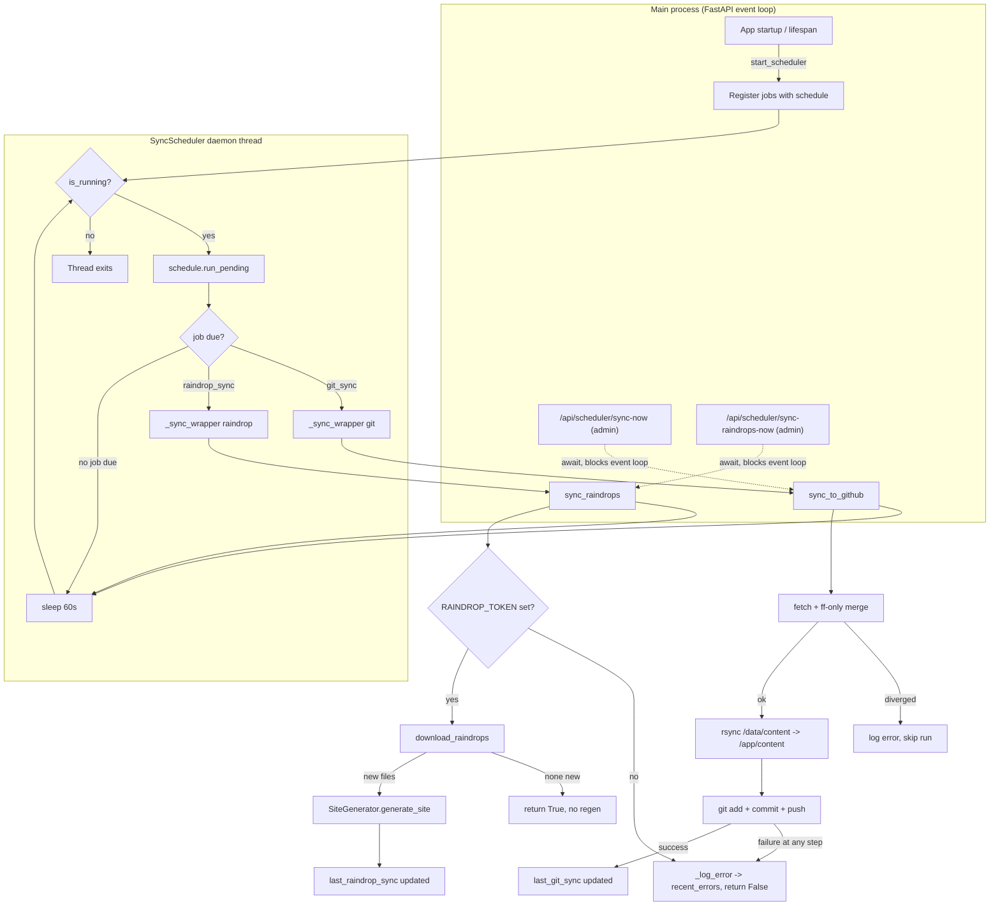

# `scheduler.py` — Background Sync for a Volume-First Blog

## What this module is for

Salasblog2 runs on Fly.io with a persistent volume mounted at `/data/content`.
That volume — not the Git repository — is the *source of truth* at runtime:
every post the admin panel writes, every raindrop the site imports, lands
there first. But a volume on a single Fly machine is not a backup; if the
machine or the volume is lost, so is the blog. `scheduler.py` exists to close
that gap by periodically pushing `/data/content` to a GitHub repository, and,
as a second and unrelated duty, to pull new bookmarks in from Raindrop.io on
a timer so the site doesn't require someone to remember to click "sync."

Both jobs are *scheduled, recurring, and unattended* — nobody is watching
when they run. That single fact shapes almost every design decision in this
file: how failures are handled, why the jobs live on a separate thread, and
why so much of the code is defensive plumbing around two conceptually simple
operations ("copy files to git and push" / "download raindrops and
regenerate").

## Two jobs, one thread, not the event loop

FastAPI already has an event loop running. It would be reasonable to expect
these periodic jobs to be `asyncio` tasks inside it — no extra thread, no
extra event loop. Instead, `Scheduler.start_scheduler()` spins up a plain
Python `daemon` thread that runs the third-party `schedule` library's
polling loop:

```python
def run_scheduler():
    while self.is_running:
        try:
            schedule.run_pending()
            time.sleep(60)  # Check every minute
        except Exception as e:
            logger.error(f"Scheduler error: {e}")
            time.sleep(60)

scheduler_thread = Thread(target=run_scheduler, daemon=True, name="SyncScheduler")
scheduler_thread.start()
```

There's a good reason for this, even though the sync *methods themselves*
are declared `async def`. The work each job actually does — `subprocess.run`
for `git`/`rsync`, blocking HTTP calls inside `RaindropDownloader`, Jinja2
site generation — is **synchronous, blocking I/O**. Running that on the
FastAPI event loop would stall every concurrent request for as long as a
`git push` takes. A separate OS thread sidesteps the problem entirely: the
scheduler can block for seconds without touching the request-handling loop
at all.

The `schedule` library itself is not async-aware — it's a simple in-process
job registry checked by `run_pending()`, meant to be driven by a plain loop.
Wrapping it in a thread rather than teaching it about `asyncio` is the
pragmatic choice: less code, and no need to make `git`/`rsync`/HTTP calls
non-blocking just to satisfy a scheduler.

## Bridging sync scheduling and async sync methods

Because `sync_to_github()` and `sync_raindrops()` are declared `async def`
(so they can also be awaited directly from FastAPI route handlers — see
below), something has to run them from the synchronous scheduler thread.
`_run_async_in_thread()` does this the straightforward way: spin up a brand
new event loop, run the coroutine to completion, tear the loop down.

```python
def _run_async_in_thread(self, coro):
    """Run an async coroutine in a new event loop (for threading)"""
    loop = asyncio.new_event_loop()
    asyncio.set_event_loop(loop)
    try:
        return loop.run_until_complete(coro)
    finally:
        loop.close()
```

This is a well-known pattern for calling async code from a sync context,
but it's worth noting what it *isn't*: the coroutines don't actually run
concurrently with anything. Neither `sync_to_github` nor `sync_raindrops`
`await`s anything that yields control — every I/O call inside them is a
blocking `subprocess.run`/`requests` call. Declaring them `async def` buys
API symmetry with FastAPI's route handlers (`await scheduler.sync_to_github()`
in `server.py`'s `/api/scheduler/sync-now` endpoint) rather than any real
concurrency benefit inside the scheduler thread itself. A fresh event loop
per invocation is a little wasteful, but these jobs run at most a few times
an hour, so the overhead is irrelevant.

## Error isolation: one bad sync doesn't kill the scheduler

The most important property of an unattended background job is that a
single failure — GitHub is down, Raindrop's API times out, a merge
conflict — must not take the *scheduler itself* down. `scheduler.py` builds
this in at two layers.

**Layer one** is inside each sync method: `sync_to_github` and
`sync_raindrops` each wrap their entire body in `try/except Exception`,
log the error into `self.recent_errors` (capped at the last 10), and return
`False` rather than raising. Every intermediate step (`_copy_content_to_git`,
`_commit_and_push`, the fetch/merge check) already returns a `bool` and
handles its own exceptions, so failures degrade gracefully rather than
propagating.

**Layer two** is the scheduler loop itself:

```python
while self.is_running:
    try:
        schedule.run_pending()
        time.sleep(60)  # Check every minute
    except Exception as e:
        logger.error(f"Scheduler error: {e}")
        time.sleep(60)
```

Even if layer one somehow let an exception through, `run_pending()` is
itself wrapped — the loop logs and keeps going rather than letting the
thread die silently. This is belt-and-suspenders, and deliberately so: a
`Thread` that dies from an uncaught exception doesn't crash the process or
show up anywhere obvious in FastAPI's logs; it just quietly stops running,
and the next symptom is "why hasn't the backup synced in three days?" Two
layers of `try/except` make that failure mode very unlikely.

The tradeoff is that `except Exception` this broadly is normally a
style-guide smell (bare catch-alls are flagged as a **MUST-avoid** in this
project's review checklist). Here it's an intentional exception to that
rule: the whole point of a background job runner is that *nothing* it
supervises is allowed to propagate out and kill the supervisor. The
counterbalance is `_log_error()`, which makes sure every swallowed failure
is still visible — in the logs immediately, and in `recent_errors` for the
`/api/scheduler/status` debugging endpoint.

## The GitHub sync pipeline

`sync_to_github()` is the more elaborate of the two jobs because it's
protecting against a real hazard: the volume-first architecture means the
GitHub repo is a *downstream mirror*, not the primary copy, but nothing
stops someone from also editing files directly in GitHub (or another
machine instance pushing first). A naive `commit && push` would silently
clobber that history. So before touching anything, the sync fetches and
fast-forwards:

```python
self._run_command_with_retry(["git", "fetch", "origin", self.config.git_branch], timeout=30)
merge = subprocess.run(
    ["git", "merge", "--ff-only", f"origin/{self.config.git_branch}"],
    capture_output=True, text=True, timeout=30
)
if merge.returncode != 0:
    self._log_error(f"Cannot fast-forward before push — diverged history: {merge.stderr.strip()}")
    return False
```

`--ff-only` is the key choice: it refuses to merge if the local and remote
branches have diverged, rather than attempting an automatic merge that
might conflict with content the sync job has no way to resolve on its own.
A diverged history is logged as an error and the sync simply skips that
run — safe, if a little inert; nothing auto-resolves the divergence, so it
needs a human to intervene. Diverging remote history is treated as *someone
else's business*, not something this job should ever try to reconcile
unattended.

Once the local branch is confirmed current, the pipeline is linear:

1. **rsync** `/data/content` → `/app/content` (`_copy_content_to_git`) —
   the volume is not itself a git working tree, so content is mirrored into
   one that is, using `rsync -av --delete` to also remove files deleted on
   the volume.
2. `git add content/` and `git add static/images/uploads/` (uploaded
   images live alongside content and need the same backup treatment).
3. `_has_git_changes()` checks `git diff --cached --name-only` — if nothing
   changed, the sync is a no-op success (no empty commits).
4. `_commit_and_push()` commits with a timestamped message and pushes
   `HEAD:<configured-branch>`.

Every git subprocess call goes through `_run_command_with_retry`, a small
retry helper (default: 2 retries, 5-second sleep between attempts) that
absorbs the kind of transient failure a network call to GitHub is prone to
without escalating every blip into a logged error.

```python
def _run_command_with_retry(self, cmd, retries: int = 2, timeout: int = 60):
    for attempt in range(retries + 1):
        try:
            return subprocess.run(cmd, capture_output=True, text=True, timeout=timeout, check=True)
        except (subprocess.CalledProcessError, subprocess.TimeoutExpired) as e:
            if attempt == retries:
                raise
            logger.warning(f"Command failed (attempt {attempt + 1}), retrying: {e}")
            time.sleep(5)
```

## Raindrop sync, and its lazy imports

`sync_raindrops()` is comparatively simple: check for a `RAINDROP_TOKEN`,
download any new raindrops, and if there were any, regenerate the static
site so they actually appear. The one thing that stands out here is *where*
its dependencies come from:

```python
# Import raindrop module
from .raindrop import RaindropDownloader
from .generator import SiteGenerator
```

These are imported **inside the method**, not at module top — and via
**relative** import syntax. Both are deviations from this project's style
guide, which calls for absolute imports collected at the top of the file.
Neither deviation looks deliberate on inspection: `raindrop.py` and
`generator.py` import nothing from `scheduler.py` (or from `server.py`), so
there's no circular-import hazard forcing the import inward — the more
usual justification for a lazy import. The more charitable reading is that
it defers the cost of importing `requests`, `markdown`, `jinja2`, and
friends until a sync actually runs (and only when `RAINDROP_TOKEN` is
configured at all) — but that's a minor win on a module that's already
loaded once at process startup via `server.py`'s `get_scheduler()` import
chain elsewhere. On balance this reads as inconsistency rather than
intent, and worth hoisting to the top with the rest of the imports the next
time this file is touched.

## Shared mutable state and the `schedule` library's global registry

`schedule.every(...).do(...)`, used both here and directly inside
`server.py`'s `lifespan()` for unrelated stats-cache-refresh jobs, all
register against the **same process-wide default `Scheduler` instance**
inside the `schedule` package — there's no separate registry per
`Scheduler` object in this codebase. That means the single background
thread `scheduler.py` starts (`schedule.run_pending()` on a 60-second
poll) is, in practice, running *every* job anyone in the process has
registered with `schedule.every()`, not just the two this module owns:

```python
# server.py, inside lifespan()
_sched.every(_cfg("stats", "cache_refresh_seconds", default=60)).seconds.do(_stats_cache_job)
_sched.every(_cfg("posts_index", "cache_refresh_seconds", default=300)).seconds.do(posts_index_cache_job)
```

This is convenient — one thread, one poll loop, no need to plumb a
`Scheduler` reference around — but it also means `Scheduler.stop_scheduler()`
calling `schedule.clear()` clears *all* registered jobs globally, including
ones this class didn't create. That's a sharp edge worth knowing about
before adding a third caller of `schedule.every()` anywhere in the codebase.

`self.recent_errors`, `self.git_sync_count`, and `self.last_git_sync` are
also shared mutable state, written from the background thread and read
from FastAPI request handlers (`/api/scheduler/status`) running on the main
event loop's thread. `schedule`'s jobs run one at a time in the scheduler
thread and requests never *write* these fields, so the realistic failure
mode is limited to reading a slightly stale or torn value rather than any
corruption — Python's GIL makes the individual list/int operations here
atomic enough in practice. It's not formally synchronized, but the access
pattern is benign enough that it hasn't needed to be.

## Manual sync, bypassing the schedule

The scheduled jobs aren't the only way these syncs run. `server.py` exposes
`/api/scheduler/sync-now` and `/api/scheduler/sync-raindrops-now`, which
call `scheduler.sync_to_github()` / `scheduler.sync_raindrops()` directly,
`await`-ed straight from a FastAPI route handler on the main event loop —
no extra thread, no `_run_async_in_thread`. This is a case where the
blocking I/O inside those methods genuinely *does* stall the event loop for
the duration of the call, which is an accepted tradeoff for an
admin-triggered, infrequent, one-shot action but would be a poor choice for
anything on the request hot path.

## Job flow, end to end



## Observations for future improvement

- **Dead "startup job" machinery.** `_handle_sync_result`, `_cleanup_startup_job`,
  and the `is_startup` parameter on `_sync_wrapper` all exist to support a
  one-time sync job tagged `'{sync_type}_startup'` that runs once at process
  start and then removes itself — but nothing in `start_scheduler()` (or
  anywhere else in the codebase) ever schedules a job with that tag or calls
  `_sync_wrapper(..., is_startup=True)`. This looks like a partially removed
  or never-finished feature; either wire it up (so a fresh deploy syncs
  immediately rather than waiting up to `git_sync_hours` for the first
  backup) or delete the dead branches.
- **Style-guide deviations.** The lazy, relative imports in `sync_raindrops`
  (`from .raindrop import RaindropDownloader`, `from .generator import
  SiteGenerator`) should move to absolute imports at the top of the file per
  this project's conventions — no circular-import dependency was found that
  would justify keeping them inline.
- **`schedule.clear()` is a global blast radius.** `stop_scheduler()` clears
  every job registered process-wide via `schedule.every()`, not just the two
  this class owns — including `server.py`'s stats/posts-index cache-refresh
  jobs. Restarting the scheduler via the admin `/api/scheduler/start` route
  would silently drop those unrelated jobs too. Tagging every job (the git
  and raindrop jobs already are, via `.tag()`) and clearing by tag would
  scope this correctly.
- **Fixed retry/backoff.** `_run_command_with_retry`'s 5-second fixed delay
  and 2-retry cap are reasonable defaults but not configurable, and there's
  no exponential backoff — a sustained GitHub outage produces the same retry
  cadence as a one-off blip.
- **No jitter or drift correction.** `schedule.every(N).minutes` runs on a
  fixed cadence from process start; on a redeploy (which restarts the
  process) the phase resets, so sync timing isn't anchored to wall-clock
  time. For a single-instance deployment this is harmless, but it's worth
  knowing if the deploy topology ever changes.
- **File header missing.** Per this project's style guide, every `.py` file
  should start with a shebang and an `Author`/`Version`/`Created`/`Updated`
  header block; `scheduler.py` currently opens directly with its module
  docstring.
