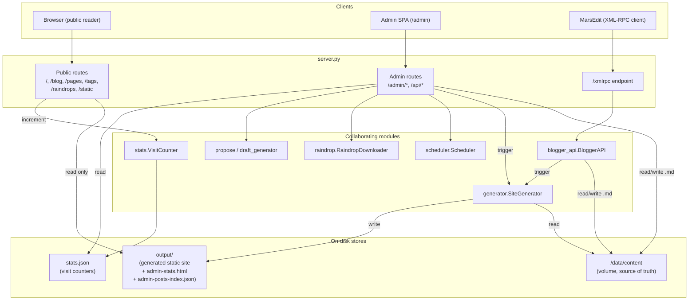

# `server.py` — The FastAPI Application

## What this module is for

`server.py` is the entire runtime surface of Salasblog2: one FastAPI `app`
object carrying every HTTP route the deployed service answers. At roughly
2,280 lines it is by a wide margin the largest module in the project, and
that size is not an accident of neglect so much as a consequence of what
the project actually needs to expose over HTTP — a public static site, a
password-gated admin single-page app, a legacy XML-RPC endpoint for a
desktop blogging client, and a handful of Fly.io-specific operational
levers (volume sync, emergency restore, scheduler control).

Every other module in the project (`generator`, `raindrop`, `blogger_api`,
`scheduler`, `utils`, `stats`, `visitor_type`, `propose`,
`draft_generator`) exists to be *called from* `server.py`. This module owns
no business logic of its own beyond request plumbing, auth checks, and a
few content-management helpers shared across routes — it is the
orchestration layer, not a place where anything is computed from first
principles. Understanding `server.py` is largely understanding how those
other modules are wired together, and why.

## Architectural overview: three request families sharing two stores

Every request into this app belongs to one of three families, and each
family touches the same two on-disk stores in a different way:

- **Public site routes** (`/`, `/blog/*`, `/pages/*`, `/tags/*`,
  `/raindrops/*`, `/static/*`) — read-only, serve pre-rendered files out of
  `output/`, and record a visit in `stats.json` as a side effect.
- **Admin routes** (`/admin`, `/admin/*`, most of `/api/*`) — a
  session-authenticated single-page app that reads and writes Markdown
  content under `/data/content`, and triggers regeneration of `output/`.
- **XML-RPC** (`/xmlrpc`) — a third protocol entirely, for MarsEdit,
  reaching the same content store through `BloggerAPI` rather than through
  the admin form handlers.



The recurring shape: **admin writes go to `/data/content`; `SiteGenerator`
turns that content into `output/`; public routes only ever read
`output/`.** No public route touches `/data/content` directly, and no
public route does any Markdown parsing or template rendering at request
time — that work has already happened by the time a reader's browser asks
for a page.

## Volume-first content storage

Three directories matter, and confusing them is the single easiest way to
misunderstand a bug report in this project:

- **`/data/content`** — a persistent Fly.io volume. This is the *source of
  truth* at runtime: every admin edit, MarsEdit post, and raindrop sync
  writes here.
- **`/app/content`** — baked into the Docker image from whatever was in git
  at build time. `startup.sh` runs `git checkout -f -B main origin/main`
  against this directory on every container boot, which means **anything
  written only to `/app/content` is wiped the next time the container
  restarts**. It exists so a fresh volume can be seeded, and so the
  scheduler has something to `git push` from.
- **`output/`** — the generated static site. Nobody hand-edits this; it is
  entirely a build artifact of `SiteGenerator` reading `/data/content` (or
  `content/` locally, when there's no volume) and writing HTML/JSON.

`get_content_directory()` is the single place this resolution logic lives
for `server.py`:

```python
def get_content_directory(content_type: str) -> Path:
    """Get directory for content type using volume-first logic (same as generator)"""
    volume_content_dir = Path("/data/content")
    if volume_content_dir.exists():
        content_dir = volume_content_dir
    else:
        content_dir = config["root_dir"] / "content"

    return content_dir / content_type
```

The same `Path("/data/content").exists()` check appears independently in
`SiteGenerator.__init__` and in `BloggerAPI.__init__` (see the
`06-blogger_api.md` companion doc) — three copies of the same
existence-check idiom rather than one shared helper imported by all three.
It's a small duplication, but it's exactly the kind of thing that could
silently drift: if the volume path or the fallback path ever changed, all
three copies would need to change together. `startup.sh`'s own comment
calls this out as "volume-first architecture" — it's a deliberate,
project-wide convention, just one that isn't factored into shared code.

The `/api/sync-*` and `/api/emergency-restore` routes exist entirely to
manage the relationship between these two content copies — pushing volume
changes into the git-tracked `/app/content` so the scheduler can commit
them, pulling git history back down to reseed or recover the volume, and
(in the emergency case) accepting that this is a destructive, one-way
overwrite:

```python
@app.post("/api/emergency-restore")
async def emergency_restore_from_github():
    """
    EMERGENCY: Restore /data/content from GitHub repository
    WARNING: This overwrites the persistent volume with repository content!
    """
```

Notice this route takes a backup copy of `/data/content` before
overwriting it, and restores that backup if the subsequent `rsync` fails —
a small but real safety net around an otherwise irreversible operation.

## Static pre-generation: precompute, serve flat, invalidate on write

The most interesting architectural pattern in this file is one that
appears twice, in nearly identical shape: **for data that changes
infrequently relative to how often it's read, precompute a static
JSON/HTML file into `output/`, serve it on `GET` with zero computation, and
regenerate it immediately whenever the underlying data changes.** This is
a straightforward instance of *cache invalidation by write-through
regeneration* rather than time-based expiry — the cache is never allowed
to be more than one background task behind reality, but a `GET` handler
never has to decide whether to trust it.

### The stats page

Visit counts live in `stats.json`, updated on every public page view via
`get_counter().increment(...)`. Rendering that into an HTML report (five
time periods, grouped by path and visitor type) is real work — Jinja2
template rendering plus aggregation — that would be wasteful to redo on
every admin dashboard load. `generate_stats_cache()` does it once and
writes the result to `output/admin-stats.html`; the route just serves the
file:

```python
@app.get("/admin-stats.html")
async def serve_admin_stats(request: Request):
    """Serve the pre-generated static stats page."""
    if config["admin_password"] and not is_admin_authenticated(request):
        return RedirectResponse(url="/admin", status_code=302)
    stats_file = config["output_dir"] / "admin-stats.html"
    if stats_file.exists():
        return HTMLResponse(content=stats_file.read_text(encoding="utf-8"))
    return HTMLResponse(content="<p>Stats not yet generated.</p>")
```

The lifespan startup handler writes a placeholder (`_STATS_PLACEHOLDER`)
before the first real generation completes, so the route never has to
special-case "not generated yet" as an error — there's always *some* file
to serve. A `schedule` job then refreshes the cache every
`stats.cache_refresh_seconds` (default 60s), so the dashboard is never more
than a minute stale even if nobody's edit action happened to trigger a
refresh.

### The admin posts index

The "All Posts" admin tab needs a list of every blog post and page —
filename, title, date, type — to render a table. Scanning every Markdown
file's frontmatter on each request is exactly the kind of directory-walk
that gets slower as the blog grows. `generate_posts_index_cache()` builds
that list once into `output/admin-posts-index.json`; every create, edit,
and delete route schedules a background regeneration of it, and a separate
`schedule` job also refreshes it every `posts_index.cache_refresh_seconds`
(default 300s) as a backstop:

```python
@app.get("/api/admin-posts")
async def list_admin_posts(request: Request):
    """..."""
    output_dir = config.get("output_dir")
    index_file = output_dir / "admin-posts-index.json" if output_dir else None
    if index_file and index_file.exists():
        return JSONResponse(content=json.loads(index_file.read_text(encoding="utf-8")))

    loop = asyncio.get_event_loop()
    await loop.run_in_executor(None, generate_posts_index_cache)
    ...
```

The fallback path — generate the cache synchronously if it's somehow
missing — means this route degrades gracefully to a live scan rather than
returning an empty list or an error, at the cost of one slow request the
very first time it's ever hit.

Both caches follow the same three-part shape: a *generator function*
that's pure with respect to its inputs (content on disk) and writes one
output file; a *route* that only reads that file; and *invalidation
call-sites* scattered through every mutating route
(`background_tasks.add_task(generate_posts_index_cache)` appears after
every post/page create, edit, and delete). The tradeoff this pattern makes
explicit: a reader can very briefly see stale data (between a write and
the background task completing), in exchange for every read being
essentially free. For an admin dashboard viewed by one person, that's a
clearly correct trade.

## Non-blocking I/O in an async framework

FastAPI's route handlers run on an asyncio event loop; a blocking call
inside an `async def` route — a subprocess, a slow file scan, a Claude API
call — stalls every other request the process is currently handling.
`server.py` is disciplined about pushing such work off the event loop
through two mechanisms, chosen based on whether FastAPI's own primitive
fits:

**`BackgroundTasks`**, for work that should happen *after* the response
has already been sent — the caller doesn't need the result, just knows the
request will eventually take effect:

```python
background_tasks.add_task(_regenerate_in_background, filename, "blog")
background_tasks.add_task(generate_posts_index_cache)
return JSONResponse(content={"status": "success", ...})
```

This is used for every incremental site regeneration triggered by a
post/page save or delete, and for the posts-index cache refresh. It's what
lets the admin editor's "Save" button return in milliseconds instead of
waiting for `SiteGenerator` to rewrite the post page, the blog listing,
the home page, and the search index.

**`loop.run_in_executor(None, fn)`**, for work whose *result* the caller
does need back in the same response — this runs `fn` in a thread pool and
`await`s it, so the event loop stays free for other requests in the
meantime:

```python
@app.get("/api/regenerate")
async def regenerate_site(request: Request):
    """Regenerate the static site (admin only)"""
    ...
    loop = asyncio.get_event_loop()
    result = await loop.run_in_executor(None, do_regenerate)
    return JSONResponse(content=result)
```

This shows up for full site regeneration, the raindrop sync (via
`asyncio.create_task(run_sync())` wrapping the executor call, so the route
can return `"started"` immediately and the caller polls
`/api/sync-status`), the `/api/propose` and `/api/propose-drops` scans, and
the Claude-backed `/api/generate-draft` call. Both mechanisms exist for the
same underlying reason — FastAPI is a single event loop, and blocking
operations (subprocess calls, directory scans, XML-RPC regeneration,
Claude API round-trips) must not run on it directly — but they answer
different questions: *"does the caller need to wait for a result"* decides
which one applies.

One asymmetry worth noting: `_regenerate_in_background` (used by the admin
form routes) always spawns a *new* `SiteGenerator()` and calls
`incremental_regenerate_post`, while `/api/regenerate` calls the heavier
`generate_site()` — the full-site rebuild is reserved for explicit "rebuild
everything" requests and first-time raindrop syncs, never triggered
implicitly by a single edit.

## Content management: one editor, two content types

`post_editor.html` is a single template used for creating and editing both
blog posts and pages — the routes differ only in which `content_type`
string, URL prefix, and tag list they pass into the shared context. This
is why `/admin/edit-post/{filename}`, `/admin/new-post`,
`/admin/edit-page/{filename}`, and `/admin/new-page` all render the same
template with a slightly different `context` dict:

```python
context = {
    "filename": filename,
    "content_type": "blog",
    "content_type_title": "Post",
    "action_url": f"/admin/edit-post/{filename}",
    "cancel_url": "/blog/",
    "blog_tags": load_top_tags(),
    "is_edit": True,
    **post_data,
}
```

Behind that shared template sits a genuinely shared backend pipeline, not
just a shared view:

- `get_content_directory(content_type)` resolves where the file lives
  (volume-first, as above).
- `create_filename_for_content()` derives a filename — date-prefixed for
  blog posts (`2026-01-15-my-title.md`), bare for pages
  (`my-title.md`) — reflecting that pages are timeless and posts are
  chronological.
- `load_content_item()` parses frontmatter into a plain dict the template
  can render, and also returns the file's `mtime` at load time.
- `save_content_item()` takes a `ContentFields` dataclass (title, date,
  type, content, tags, image_size, category) and writes it back out with
  `frontmatter.dumps()`, followed by `f.flush()` + `os.fsync()` — the same
  durability discipline `BloggerAPI` uses for XML-RPC-originated writes,
  applied here to admin-form writes too.
- `delete_content_item()` and `regenerate_after_deletion_in_background()`
  are the deletion-side mirror of save + regenerate.

### Optimistic concurrency, not locking

Because the admin editor is a plain HTML form with no live collaboration
protocol, two browser tabs (or an admin editing while a MarsEdit sync
happens) could both load the same post and both submit a save. Rather than
implement real locking, `save_edited_post`/`save_edited_page` pass the
`mtime` the edit form was rendered with back as a hidden field, and
`check_no_concurrent_edit()` compares it against the file's current mtime
at save time:

```python
def check_no_concurrent_edit(content_file: Path, loaded_mtime: str):
    """Reject a save if the file changed on disk since the editor loaded it.
    ...
    An empty/missing value (e.g. an old cached page, or a client that
    doesn't send it) skips the check rather than blocking the save — this
    is a best-effort conflict warning, not a hard lock.
    """
```

If the mtimes disagree, the save is rejected with `409 Conflict` and a
message asking the user to reload. This is explicitly a *best-effort*
check, not a guarantee: a missing or malformed `loaded_mtime` silently
skips the check rather than blocking the save, so it protects against the
common case (a stale tab) without introducing a hard failure mode for
edge cases (an old cached page, or a client that never sends the field).

## MarsEdit / XML-RPC

`/xmlrpc` exists so MarsEdit — a native macOS blog editor many writers
prefer over any web form — can post to this blog using two decades-old
protocols, Blogger API and MetaWeblog API, that it still speaks natively.
`server.py`'s job here is narrowly scoped: parse the wire format, dispatch
to the right `BloggerAPI` method, and marshal the response — all the
actual "write a post" logic lives in `blogger_api.py` (see
`06-blogger_api.md`).

The parsing itself leans entirely on Python's standard library rather than
a hand-rolled parser:

```python
try:
    raw_params, method_name = xmlrpc_client.loads(body)
except Exception as e:
    ...
```

The comment in the code is worth repeating because it explains a real,
previously-shipped bug: an earlier hand-built `ElementTree` parser only
understood `string`/`boolean`/`int`/`base64`/one-level `struct`, and
silently *dropped* anything else — `dateTime.iso8601` values, arrays,
nested structs. Switching to `xmlrpc.client.loads()` fixed a whole class of
"MarsEdit sends something valid, our parser mangles it" bugs at once,
for the cost of one extra unwrapping step: the stdlib decodes `<base64>`
payloads as `xmlrpc.client.Binary` wrapper objects, which `unwrap_xmlrpc_binary()`
recursively strips back to plain `bytes` before anything downstream (which
expects plain bytes) sees them.

Dispatch is a small lookup-table pattern, and it's where the
background-task-threading decision from the async section above shows up
again at the protocol boundary:

```python
def call_xmlrpc_method(api, method_name, method_args, background_tasks):
    regenerating_methods = {
        "blogger.newPost": api.blogger_newPost,
        "blogger.editPost": api.blogger_editPost,
        "blogger.deletePost": api.blogger_deletePost,
        "metaWeblog.newPost": api.metaweblog_newPost,
        "metaWeblog.editPost": api.metaweblog_editPost,
    }
    other_methods = {
        "blogger.getRecentPosts": api.blogger_getRecentPosts,
        ...
    }
    if method_name in regenerating_methods:
        return regenerating_methods[method_name](*method_args, background_tasks=background_tasks)
    if method_name in other_methods:
        return other_methods[method_name](*method_args)
    ...
```

Only the methods that mutate content receive `background_tasks` — so
"Post" in MarsEdit returns promptly while regeneration happens after the
response, exactly mirroring the admin form's save behavior, and read-only
methods (`getRecentPosts`, `getPost`, `getCategories`) never pay for
threading a parameter they don't need.

Response marshalling gets the same care, wrapped in its own `try/except`
even though the *business logic* already succeeded by that point:

```python
try:
    response_xml = create_xmlrpc_response(result)
except Exception:
    logger.exception(...)
    response_xml = xmlrpc_client.dumps(
        xmlrpc_client.Fault(500, f"Server failed to marshal response for {method_name}")
    )
    return Response(content=response_xml, media_type="text/xml", status_code=200)
```

The reasoning is spelled out in the comment: if marshalling raised
uncaught, FastAPI would return a plain HTML 500 error page — not XML — and
MarsEdit's client-side parser has no way to recover from that gracefully;
historically it surfaced as an opaque "XMLRPC Response Parsing Failed:
(null)" in the MarsEdit UI. Every failure path in this route, whatever its
origin, is deliberately routed back through `xmlrpc_client.dumps(Fault(...))`
so the client always gets well-formed XML back, even when the server side
is failing.

## The admin panel

`/admin` serves a single template, `admin.html`, that behaves as a
tabbed single-page app: Stats, Propose, Drafts, All Posts, Generate,
Scheduler, Data Sync, Pages Sync, Raindrop, and Emergency each get their
own pane, switched client-side, all backed by the same set of `/api/*` and
`/admin/*` routes described elsewhere in this document. `server.py` itself
has no notion of "tabs" — it just serves the one HTML shell and a family
of JSON endpoints the page's JavaScript calls into.

### Authentication

Auth is intentionally simple: a single shared `ADMIN_PASSWORD` checked
against a session flag, no per-user accounts.

```python
def is_admin_authenticated(request: Request) -> bool:
    """Check if admin is authenticated via session"""
    return request.session.get("admin_authenticated", False)
```

`SessionMiddleware` is registered directly against
`os.getenv("SESSION_SECRET", "fallback-dev-key")` at import time, with a
comment explaining why it can't read from the `config` dict like
everything else does: *"middleware registers before lifespan"* — FastAPI
builds its middleware stack when `app.add_middleware()` is called, which
happens at module import, well before `lifespan()`'s startup code has
populated `config`. The `"fallback-dev-key"` default is a deliberate
local-dev convenience, not a production default — Fly.io deployment sets
`SESSION_SECRET` for real.

Nearly every admin and `/api/*` route repeats the same two-line guard:

```python
if config["admin_password"] and not is_admin_authenticated(request):
    raise HTTPException(status_code=401, detail="Authentication required")
```

If `ADMIN_PASSWORD` is unset entirely, every route treats the instance as
open — intended for local development, logged loudly
(`"No ADMIN_PASSWORD set - allowing unrestricted admin access"`) — which
means this guard doubles as *both* the authentication check and the
"is auth even configured" check in one condition. The guard is duplicated
verbatim across roughly twenty route handlers rather than factored into a
FastAPI dependency; see the observations below.

## Public site serving and visit counting

Public content isn't served through FastAPI's `StaticFiles` mount for most
paths — `server.py` defines its own handlers for `/blog/*`, `/pages/*`,
`/tags/*`, `/raindrops/*`, and `/static/*`. The comment at the top
explains why: *"Custom endpoints to fix FastAPI StaticFiles HEAD/GET
inconsistency."* Each handler reads the file for `GET` and returns an
empty body for `HEAD`, so both methods report the same headers and status
without `StaticFiles`' differing behavior between the two. `mount_static_files()`
still exists and is called from the `__main__` block for local
development, but is commented out of the `lifespan()` startup path in
favor of these custom routes in normal operation.

Every content-serving route (except the raw `/static/*` asset route) also
increments a visit counter, classifying the visitor first:

```python
if request.method == "GET" and str(full_path).endswith(".html"):
    vtype = classify_visitor(
        request.headers.get("user-agent", ""),
        request.headers.get("accept-language", ""),
    )
    get_counter().increment(f"/blog/{file_path}", vtype)
```

`classify_visitor()` (in `visitor_type.py`) buckets requests by user agent
and language header — separating bots/crawlers from human visitors, for
instance — so the stats dashboard can report meaningful traffic rather
than raw hit counts inflated by scrapers. This is the same `stats.json`
data source the pre-generated `admin-stats.html` cache reads from.

The catch-all route (`GET/HEAD /{path:path}`) is deliberately placed *last*
in the file, and the comment says so explicitly — FastAPI matches routes
in registration order, so a broad wildcard registered earlier would shadow
every more specific route defined after it. This route also tries
`{path}.html` as a fallback when the literal path doesn't exist and has no
extension, which is what lets `/about` resolve to `about.html` in
`output/`.

### Path traversal protection

Every route that resolves a client-supplied path segment into a filesystem
path funnels it through `_safe_resolve()`:

```python
def _safe_resolve(base_dir: Path, file_path: str) -> Path | None:
    """Resolve file_path within base_dir, blocking traversal, symlink escapes, and hidden files."""
    if any(part.startswith(".") for part in Path(file_path).parts):
        return None
    full_path = (base_dir / file_path).resolve()
    if not full_path.is_relative_to(base_dir.resolve()):
        return None
    return full_path
```

`.resolve()` collapses `..` segments and symlinks before the
`is_relative_to()` check runs, which is what makes this safe against both
naive `../../etc/passwd`-style traversal *and* a symlink planted inside
`output/` that points somewhere else on disk. Not every content route uses
it, though — `/blog/*`, `/pages/*`, and `/tags/*` build their path with a
plain `base / file_path` join and rely only on FastAPI's own path-segment
handling; only `/static/*`, `/raindrops/*`, and the root catch-all call
`_safe_resolve()` explicitly. Given all these paths ultimately originate
from `output/`, a generated, trusted directory, the practical exposure is
limited — but it's an inconsistency worth being aware of rather than an
intentional layered design.

## Lifespan: startup as a checklist

FastAPI's `lifespan` context manager replaces the older `@app.on_event`
hooks, and this project uses it as a fairly literal ordered checklist:
configure logging, validate environment (paths, Jinja env), guard against
accidentally running more than one Fly.io machine at once, start the
background scheduler, pre-warm both static caches, then register the
`schedule` jobs that keep them warm.

```python
scheduler = get_scheduler()
scheduler.start_scheduler()

output_dir = config.get("output_dir")
if output_dir:
    (output_dir / "admin-stats.html").write_text(_STATS_PLACEHOLDER, encoding="utf-8")
try:
    generate_stats_cache()
except Exception as e:
    logger.warning("Initial stats cache generation failed: %s", e)
```

`_check_single_instance()` is a Fly.io-specific safety check — it shells
out to `fly machines list --json` and raises if more than one machine is
`started`, because this app's persistent-volume-plus-git-sync design
assumes exactly one writer. It no-ops entirely off Fly.io (no
`FLY_APP_NAME` env var), so local development is unaffected. Every failure
mode inside this function beyond "more than one machine" — timeout,
missing `fly` CLI, any other exception — is caught and logged as a
warning rather than escalated, which means the check is best-effort: it
protects against the common case, an accidental second machine, but
won't block startup if the check itself can't run.

## Observations for future improvement

- **This file should be split into routers.** At 2,280 lines, `server.py`
  mixes route registration, business-adjacent helpers (`ContentFields`,
  `save_content_item`), background-job scheduling, and low-level static
  file serving in one module. FastAPI's `APIRouter` would let public
  routes, admin/content routes, sync/scheduler routes, and the XML-RPC
  endpoint each live in their own file, included into `app` from a much
  smaller top-level module — the project's own comments already flag this
  as a known gap.
- **The `if config["admin_password"] and not is_admin_authenticated(request): raise HTTPException(401, ...)` guard is duplicated across roughly twenty routes.** A FastAPI dependency (`Depends(require_admin)`) would collapse this to one declaration per route signature and remove the risk of a future route forgetting the check entirely — a straightforward win with no design tradeoff attached.
- **Path-traversal protection is inconsistent.** `_safe_resolve()` guards `/static/*`, `/raindrops/*`, and the root catch-all, but `/blog/*`, `/pages/*`, and `/tags/*` build paths with a plain join. All paths currently resolve under the trusted, generated `output/` directory, so the practical risk is low today — but the inconsistency itself is worth closing so the safety property holds by construction rather than by which directory happens to be involved.
- **Volume-first path resolution (`Path("/data/content").exists()`) is duplicated in three places** — `server.py`'s `get_content_directory()`, `SiteGenerator.__init__`, and `BloggerAPI.__init__` — rather than defined once and imported. A shared helper would guarantee all three modules agree on what "volume-first" means if the layout ever changes.
- **`/xmlrpc`'s dispatch table (`call_xmlrpc_method`) and the admin form routes implement two independent write paths into the same content store**, one going through `BloggerAPI`, one through `save_content_item`/`ContentFields`. They already converge on the same durability practice (`flush()` + `fsync()`) and the same background-regeneration pattern, but that convergence is currently maintained by two authors remembering to keep them in sync rather than by shared code.
- **The stats and posts-index caches each have their own hand-written invalidation call sites** at every mutating route, rather than a single decorator or dependency that says "this route changes content, refresh the relevant caches." As more cached views get added (a likely direction given how well this pattern has worked twice already), the number of places that need to remember to call `background_tasks.add_task(generate_*_cache)` will keep growing linearly with the number of write routes.
