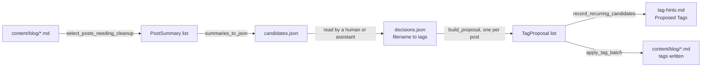
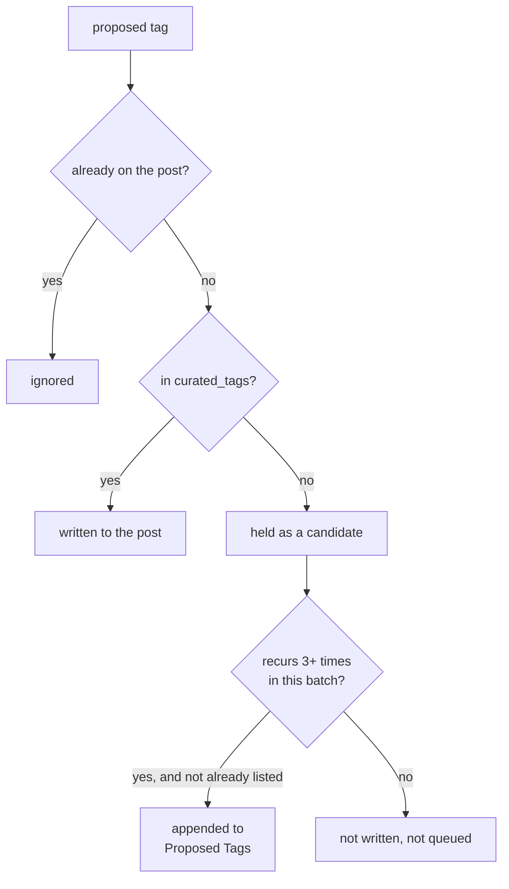

# `tag_cleanup.py` — Automated Tag Cleanup for a 2,800-Post Archive

Salasblog2's archive carries nearly two decades of posts. Most of the
oldest ones were imported from WordPress, and their `tags` frontmatter is
either empty or a handful of raw numeric category IDs (`"1221"`,
`"2340"`) — leftovers from an export format, not real topics. Retagging
2,800 posts by hand, one at a time, doesn't scale. `tag_cleanup.py` is the
pure logic behind a pipeline that does it in reviewable batches: select the
posts that need work, hand their title/excerpt to a human (or an assistant
acting in a session) to decide tags, sanitize and apply the result, and
track what's already been decided so nothing gets asked twice.

The module deliberately does *no I/O beyond reading and writing post
files* — no network call, no LLM API client. That's not an oversight; it's
the result of a design reversal recorded below.

## Why there's no API call in a "Claude-based" tagging pipeline

The original plan was conventional: call the Claude API (the `anthropic`
Python client, the same pattern `draft_generator.py` already uses
elsewhere in this codebase) to propose tags for each post. That plan was
dropped after discovering the local `ANTHROPIC_API_KEY` draws against a
separate pay-as-you-go credit balance — not the Claude Code subscription
already paying for the assistant session doing this work. There was no way
to bill a standalone API call against a subscription that doesn't expose
billing that way.

The fallback turned out to be the better design anyway: `summarize_post()`
extracts exactly what's needed to decide tags — title, current tags, a
markdown-stripped excerpt — into a small `PostSummary`, with no model call
inside the pure-logic module at all. Something else (a human, or an
assistant reading the summaries directly in its own context) supplies the
decisions as a plain `{"filename": ..., "tags": [...]}` list. The pipeline
never cares how a decision was reached — only how it validates and applies
one. That separation is what makes every function below independently
testable without mocking an LLM.



## Selection: telling "never looked at" from "looked at, no fit"

`needs_tag_cleanup()` is the one-line rule at the center of the whole
pipeline:

```python
def needs_tag_cleanup(tags: list[str], reviewed_no_fit: bool) -> bool:
    if has_numeric_tag(tags):
        return True
    return not tags and not reviewed_no_fit
```

A post needs work if it still carries numeric junk — always true,
regardless of history — or if it has no tags *and hasn't already been
reviewed*. That second clause exists because of a bug this pipeline
actually shipped with for a while: early batches counted "no tags" alone
as "needs cleanup," which is correct the first time a post is looked at,
but wrong forever after. A post that's genuinely thin — a bare link, a
one-line joke, an ad — gets reviewed and correctly decided to have no good
tag. Its `tags` field is still empty afterward. Under the naive rule, that
empty list makes it indistinguishable from a post nobody has ever looked
at, so it comes right back into the next batch's candidate list. And the
one after that. Running the pipeline against the real archive, this showed
up immediately and concretely: one batch's candidates overlapped the
previous batch's *entire no-fit count* — every post that had already been
decided "no fit" came straight back, batch after batch, while genuinely
new posts made up a shrinking fraction of each run.

The fix is a frontmatter marker, not a side file:

```python
NO_FIT_MARKER_FIELD = "tag_review"
NO_FIT_MARKER_VALUE = "no_fit"
```

`apply_tag_proposal()` sets `tag_review: no_fit` on a post whenever its
final tag list ends up empty, and clears the field the moment a later call
gives it real tags. `select_posts_needing_cleanup()` reads that marker
straight off each post's own frontmatter to compute `reviewed_no_fit`.
There's no progress file to keep in sync with reality, no counter that can
drift from what's actually on disk — the post's own state *is* the
record, which is the same principle the module already followed for
selection itself (re-scanning after a fix naturally excludes it; no offset
to manage). A design that needed a second source of truth would have
introduced exactly the kind of drift this fix was written to eliminate.

## The curated-vocabulary rule, and where a rejected tag actually goes

The blog keeps a single curated tag vocabulary in `02-doc/tag-hints.md`
(loaded via `utils.load_curated_tags()` — shared with the post editor's
suggestion picklist and MarsEdit's category list, so there's exactly one
list, not two that can drift apart). The rule this pipeline enforces: a
*new* tag only gets written to a post if it's in that curated list. An
existing tag is never removed, regardless of whether it happens to be
curated — that guarantee is unconditional.

```python
def split_new_tags(existing_tags, new_tags, curated_tags):
    existing = set(existing_tags)
    accepted, candidates = [], []
    for tag in new_tags:
        if tag in existing:
            continue
        (accepted if tag in curated_tags else candidates).append(tag)
    return accepted, candidates
```

A tag proposed for a post falls into exactly one of three buckets: already
there (ignored — nothing to add), curated (accepted, gets written), or
neither (held back as a *candidate*). Candidates are never silently
dropped — that would waste a real, possibly-good signal about a topic the
curated list doesn't cover yet. Instead, `record_recurring_candidates()`
tallies every candidate tag across a whole batch, and any tag that shows
up on at least `MIN_RECURRENCE_FOR_PROPOSED_TAG` (3) separate posts gets
appended to tag-hints.md's own "Proposed Tags" section — a queue the human
maintaining the vocabulary reviews and promotes (or rejects) by hand,
outside the pipeline entirely. A one-off candidate that never recurs just
stays uncaptured; a genuinely emerging topic across the archive earns its
way onto the list instead of the pipeline ever inventing vocabulary
unilaterally.



## Applying a batch without ever risking the post body

`apply_tag_proposal()` is the only function in the module that writes to a
content file, and it treats that as a genuinely risky operation worth
verifying rather than trusting:

```python
def apply_tag_proposal(blog_dir, filename, tags):
    path = blog_dir / filename
    with open(path, "r", encoding="utf-8") as f:
        post = frontmatter.load(f)
    original_body = post.content

    post.metadata["tags"] = tags
    if tags:
        post.metadata.pop(NO_FIT_MARKER_FIELD, None)
    else:
        post.metadata[NO_FIT_MARKER_FIELD] = NO_FIT_MARKER_VALUE
    path.write_text(frontmatter.dumps(post), encoding="utf-8")

    with open(path, "r", encoding="utf-8") as f:
        rewritten = frontmatter.load(f)
    if rewritten.content != original_body:
        raise ValueError(f"{filename}: body content changed after tag write")
    if rewritten.metadata.get("tags") != tags:
        raise ValueError(f"{filename}: tags did not persist correctly")
```

The read-back-and-compare at the end isn't defensive boilerplate — it's
the one guarantee that lets a batch of hundreds of automated writes run
against a live archive without a human diffing every file afterward. A bug
that scrambled the YAML frontmatter parser, or a frontmatter-library
version quirk that reflowed the body text, would corrupt a post's content
silently otherwise; here it raises immediately, on the exact file it
happened to, with the body untouched (the write already happened, but the
raised exception stops the batch and surfaces precisely which post needs a
human to look at it — better than a plausible-looking success that turns
out to have quietly damaged a decade-old post). `apply_tag_batch()` layers
a `"skip": true` escape hatch on top for a reviewed batch where a human
decided a specific entry shouldn't be applied after all, without needing a
separate code path to omit it upstream.

## Observations for future improvement

- **`record_recurring_candidates()` re-parses tag-hints.md's "Proposed
  Tags" section from scratch on every batch** to check for already-listed
  candidates, via a full file read and re-scan. Fine at the file's current
  size; would be worth caching if the file grows enough that every batch
  run pays for a repeated linear scan.
- **The no-fit marker is a plain string match** (`tag_review == "no_fit"`)
  rather than a small enum or constant class shared with anything that
  might read it elsewhere (e.g. an admin UI wanting to show "reviewed, no
  fit" as a post's status). Fine as an internal implementation detail
  today; worth promoting to a shared constant if a second consumer shows
  up.
- **`MIN_RECURRENCE_FOR_PROPOSED_TAG` is a fixed module constant (3)**,
  not configurable per run. If the archive's remaining un-tagged tail
  turns out to need a different threshold (larger batches might want a
  higher bar; a final small batch might want a lower one to still surface
  genuine signal), it would need to become a parameter rather than a
  constant.
- **No dry-run mode.** `apply_tag_batch()` always writes; testing a batch
  of decisions before committing to them currently means inspecting the
  `TagProposal` list built by `build_proposal()` separately and choosing
  not to call `apply_tag_batch()` yet — which is exactly the two-step
  shape the CLI scripts around this module already use, but it's worth
  naming as the mechanism rather than an implicit convention.
